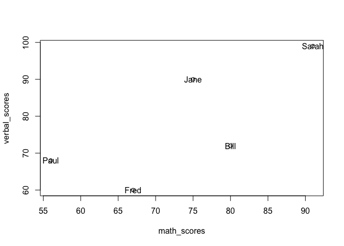

Introduction to R
================

This Rmarkdown script provides a description of some of the building
blocks we will rely on throughout this course. If you’re having trouble
following the code below, make sure you have finished the R preparatory
course and read the required chapters in Wickham’s *Advanced R*.

### Using R as a calculator

The most basic functionality of R is using it as a calculator

``` r
10 / 2
```

    ## [1] 5

``` r
sqrt(100) + sqrt(9)
```

    ## [1] 13

``` r
exp(1)
```

    ## [1] 2.718282

``` r
2^3
```

    ## [1] 8

### Objects and operators

What makes R very powerful is that you can store results as “objects”

``` r
x <- 5
y <- 10
```

If you look at the `Environment` panel in your RStudio session, you can
see that these numbers are stored in memory.

Then you can do operations with them, the same way you would do with
numbers:

``` r
x * y
```

    ## [1] 50

You can also save combinations of objects as new objects

``` r
z <- x * y
z
```

    ## [1] 50

You can also modify existing objects.

``` r
x <- x + 1
x
```

    ## [1] 6

Note that we’ve used the `<-` sign to assign values to objects. That’s
the *assignment* operator. Using `<-` instead if `=` also emphasizes
that the `=` used in programming is conceptually not a mathematical
equal sign.

``` r
x = x + 1
x
```

    ## [1] 7

You can also use `=`, although `<-` is generally preferred. There’s a
more technical explanation for this preference, but another is that this
way you avoid getting confused with `==`, which is used to compare
objects:

``` r
2 == 2
```

    ## [1] TRUE

``` r
c(1, 2, 3) == 2
```

    ## [1] FALSE  TRUE FALSE

`==` is a *logical operator*, meaning it outputs `TRUE` or `FALSE`.
Other logical operators are:

``` r
1 != 2 # not equal to
```

    ## [1] TRUE

``` r
2 < 2 # less than
```

    ## [1] FALSE

``` r
2 <= 2 # less than or equal to
```

    ## [1] TRUE

``` r
2 > 2 # greater than
```

    ## [1] FALSE

``` r
2 >= 2 # greater than or equal to
```

    ## [1] TRUE

``` r
(2 < 2) | (2 <= 2) # or
```

    ## [1] TRUE

``` r
(2 < 2) & (2 <= 2) # and
```

    ## [1] FALSE

### Data types

R has many data types, but the most common ones we’ll use are:

1.  numeric: `1.1`, `3`, `317`, `Inf`…
2.  logical: `TRUE` or `FALSE`
3.  character: `this is a character`, `hello world!`…
4.  factor: `Democrat`, `Republican`, `Socialist`, …

A small trick regarding logical values is that they correspond to `1`
and `0`. This will come in hand to count the number of `TRUE` values in
a vector.

``` r
x <- c(TRUE, TRUE, FALSE)
x * 2
```

    ## [1] 2 2 0

``` r
sum(x)
```

    ## [1] 2

There are a few special values: `NA`, which denotes a missing value, and
`NaN`, which means Not a number. The values `Inf` and `-Inf` are
considered numeric. `NULL` denotes a value that is undefined.

``` r
0 / 0 # NaN
```

    ## [1] NaN

``` r
1 / 0 # Inf
```

    ## [1] Inf

``` r
x <- c(1, NA, 0)
x
```

    ## [1]  1 NA  0

Probably one of the most useful functions in R is `str`. It displays the
internal structure of an object.

``` r
str(x)
```

    ##  num [1:3] 1 NA 0

Of course you can always print the object in the console:

``` r
print(x)
```

    ## [1]  1 NA  0

Note that `print` here is a function: it takes a series of arguments (in
this case, the object `x`) and returns a value (`50`).

This is equivalent to just typing the name of the object in the console.
(What’s going on behind the scenes is that R is calling the default
function to print this object; which in this case is just `print`).

``` r
x
```

    ## [1]  1 NA  0

You can find out the data type for each object in `R` using the function
`class`, or functions that start with `is.` and then the data type:

``` r
class("hello world!")
```

    ## [1] "character"

``` r
class(42)
```

    ## [1] "numeric"

``` r
is.numeric("hello world!")
```

    ## [1] FALSE

``` r
is.character("hello world")
```

    ## [1] TRUE

``` r
class(c(1, NA, 0))
```

    ## [1] "numeric"

``` r
is.numeric(c(1, NA, 0))
```

    ## [1] TRUE

Probably one of the most useful functions in R is `str`. It displays the
internal structure of an object.

``` r
str(as.factor(c("Blue", "Blue", "Red")))
```

    ##  Factor w/ 2 levels "Blue","Red": 1 1 2

### Data structures

Building off of the data types we’ve learned, *data structures* combine
multiple values into a single object. Some common data structures in `R`
include:

1.  vectors: sequence of values of a certain type
2.  data frame: a table of vectors, all of the same length
3.  list: collection of objects of different types

#### Vectors

We’ve already seen vectors created by **c**ombining multiple values with
the `c` command:

``` r
student_names <- c("Bill", "Jane", "Sarah", "Fred", "Paul")
math_scores <- c(80, 75, 91, 67, 56)
verbal_scores <- c(72, 90, 99, 60, 68)
```

There are shortcuts for creating vectors with certain structures, for
instance:

``` r
nums1 <- 1:100
# -10, -5, 0, ..., 100
nums2 <- seq(-10, 100, by = 5)
# 467 equally spaced numbers between -10 and 100
nums3 <- seq(-10, 100, length.out = 467)
```

Notice that we used `seq` to generate both `nums2` and `nums3`. The
different behavior is controlled by which arguments (e.g. `by`,
`length.out`) are supplied to the function `seq`.

With vectors we can carry out some of the most fundamental tasks in data
analysis, such as descriptive statistics

``` r
mean(math_scores)
```

    ## [1] 73.8

``` r
min(math_scores - verbal_scores)
```

    ## [1] -15

``` r
summary(verbal_scores)
```

    ##    Min. 1st Qu.  Median    Mean 3rd Qu.    Max. 
    ##    60.0    68.0    72.0    77.8    90.0    99.0

and plots.

``` r
plot(x = math_scores, y = verbal_scores)
text(x = math_scores, y = verbal_scores, labels = student_names)
```

<!-- -->

It’s easy to pull out specific entries in a vector using `[]`. For
example,

``` r
math_scores[3]
```

    ## [1] 91

``` r
math_scores[1:3]
```

    ## [1] 80 75 91

``` r
math_scores[-c(4:5)]
```

    ## [1] 80 75 91

``` r
math_scores[which(verbal_scores >= 90)]
```

    ## [1] 75 91

``` r
math_scores[3] <- 92
math_scores
```

    ## [1] 80 75 92 67 56

#### Data frames

Data frames allow us to combine many vectors of the same length into a
single object.

``` r
students <- data.frame(student_names, math_scores, verbal_scores)
students
```

    ##   student_names math_scores verbal_scores
    ## 1          Bill          80            72
    ## 2          Jane          75            90
    ## 3         Sarah          92            99
    ## 4          Fred          67            60
    ## 5          Paul          56            68

``` r
summary(students)
```

    ##  student_names       math_scores verbal_scores 
    ##  Length:5           Min.   :56   Min.   :60.0  
    ##  Class :character   1st Qu.:67   1st Qu.:68.0  
    ##  Mode  :character   Median :75   Median :72.0  
    ##                     Mean   :74   Mean   :77.8  
    ##                     3rd Qu.:80   3rd Qu.:90.0  
    ##                     Max.   :92   Max.   :99.0

Notice that `student_names` is a different class (character) than
`math_scores` (numeric), yet a data frame combines their values into a
single object. We can also create data frames that include new
variables:

``` r
students$final_scores <- 0
students$final_scores <- (students$math_scores + students$verbal_scores) / 2
students
```

    ##   student_names math_scores verbal_scores final_scores
    ## 1          Bill          80            72         76.0
    ## 2          Jane          75            90         82.5
    ## 3         Sarah          92            99         95.5
    ## 4          Fred          67            60         63.5
    ## 5          Paul          56            68         62.0

``` r
age <- c(18, 19, 20, 21, 22)
students2 <- data.frame(student_names, age)
students2
```

    ##   student_names age
    ## 1          Bill  18
    ## 2          Jane  19
    ## 3         Sarah  20
    ## 4          Fred  21
    ## 5          Paul  22

And merge them with other dataframes (here based on the students\_name
column)

``` r
# merge different data frames
students3 <- merge(students, students2)
students3
```

    ##   student_names math_scores verbal_scores final_scores age
    ## 1          Bill          80            72         76.0  18
    ## 2          Fred          67            60         63.5  21
    ## 3          Jane          75            90         82.5  19
    ## 4          Paul          56            68         62.0  22
    ## 5         Sarah          92            99         95.5  20

#### Lists

Lists are an even more flexible way of combining multiple objects into a
single object. As you will see throughout the course, we will use lists
to store the output of our scraping steps. Using lists, we can combine
together vectors of different lengths:

``` r
list1 <- list(some_numbers = 1:10, some_letters = c("a", "b", "c"))
list1
```

    ## $some_numbers
    ##  [1]  1  2  3  4  5  6  7  8  9 10
    ## 
    ## $some_letters
    ## [1] "a" "b" "c"

or even vectors and data frames, or multiple data frames:

``` r
schools <- list(school_name = "LSE", students = students,
                    faculty = data.frame(name = c("Kelly Jones", "Matt Smith"),
                                         age = c(41, 55)))
schools
```

    ## $school_name
    ## [1] "LSE"
    ## 
    ## $students
    ##   student_names math_scores verbal_scores final_scores
    ## 1          Bill          80            72         76.0
    ## 2          Jane          75            90         82.5
    ## 3         Sarah          92            99         95.5
    ## 4          Fred          67            60         63.5
    ## 5          Paul          56            68         62.0
    ## 
    ## $faculty
    ##          name age
    ## 1 Kelly Jones  41
    ## 2  Matt Smith  55

You can access a list component in several different ways:

``` r
schools[[1]]
```

    ## [1] "LSE"

``` r
schools[["faculty"]]
```

    ##          name age
    ## 1 Kelly Jones  41
    ## 2  Matt Smith  55

``` r
schools$students
```

    ##   student_names math_scores verbal_scores final_scores
    ## 1          Bill          80            72         76.0
    ## 2          Jane          75            90         82.5
    ## 3         Sarah          92            99         95.5
    ## 4          Fred          67            60         63.5
    ## 5          Paul          56            68         62.0

``` r
schools[["students"]]
```

    ##   student_names math_scores verbal_scores final_scores
    ## 1          Bill          80            72         76.0
    ## 2          Jane          75            90         82.5
    ## 3         Sarah          92            99         95.5
    ## 4          Fred          67            60         63.5
    ## 5          Paul          56            68         62.0
