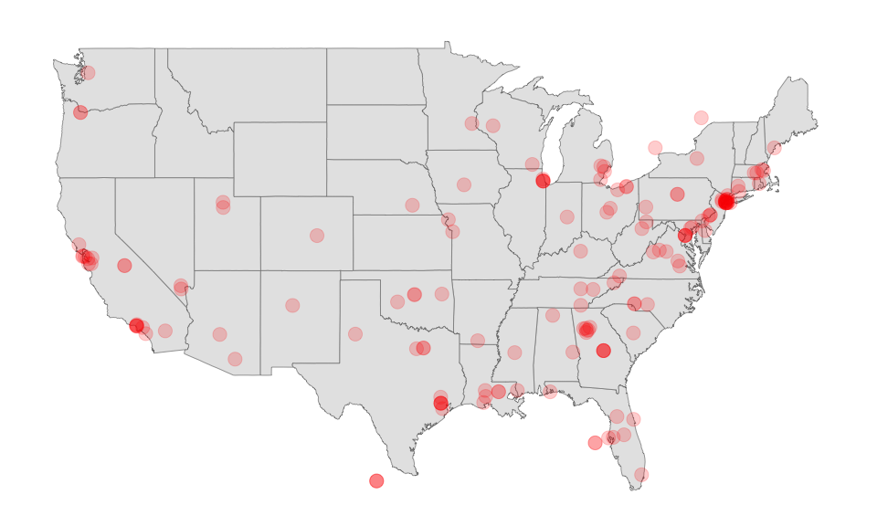

Twitter’s Streaming API
================

#### Authenticating

Before we can start collecting Twitter data, we need to create an OAuth
token that will allow us to authenticate our connection and access our
personal data.

After the new API changes, getting a new token requires submitting an
application for a developer account, which may take a few days. So for
now we will assume that we have access to one. See the instructions at
the end of the file for how to create yours once your application is
approved. We’ll come back to this during the seminars this week.

This will not work in your computer\!

``` r
library("rtweet")
```

Once you have created your token (after your application has been
approved), you can check that it worked by running the line below:

``` r
load("my_oauth.rda")

# replace the app name with your own!
twitter_token <- create_token(app = "Ken's R access", 
                              consumer_key = my_oauth$consumer_key,
                              consumer_secret = my_oauth$consumer_secret,
                              access_token = my_oauth$access_token,
                              access_secret = my_oauth$access_token_secret)

lookup_users("LSEnews")$screen_name
```

    ## [1] "LSEnews"

If this displays `LSEnews` then we’re good to go\!

Some of the functions below will work with more than one token. If you
want to save multiple tokens, see the instructions at the end of the
file.

#### Collecting data from Twitter’s Streaming API

Collecting tweets filtering by keyword:

``` r
tweets <- stream_tweets("trump", timeout = 10)
```

    ## Streaming tweets for 10 seconds...

    ## Finished streaming tweets!

``` r
head(tweets)
```

    ## # A tibble: 6 x 90
    ##   user_id status_id created_at          screen_name text  source
    ##   <chr>   <chr>     <dttm>              <chr>       <chr> <chr> 
    ## 1 117005… 11968153… 2019-11-19 15:39:47 thefarwrong "Thi… Twitt…
    ## 2 108029… 11968153… 2019-11-19 15:39:47 VOTEMAGA20… "Vin… Twitt…
    ## 3 118562… 11968153… 2019-11-19 15:39:47 RmPilgreen  I wa… Twitt…
    ## 4 828238… 11968153… 2019-11-19 15:39:47 antiableis… "@Ta… Anti-…
    ## 5 828238… 11968153… 2019-11-19 15:39:53 antiableis… "@Mi… Anti-…
    ## 6 330505… 11968153… 2019-11-19 15:39:47 HASJI       "Vin… Twitt…
    ## # … with 84 more variables: display_text_width <dbl>,
    ## #   reply_to_status_id <chr>, reply_to_user_id <chr>,
    ## #   reply_to_screen_name <chr>, is_quote <lgl>, is_retweet <lgl>,
    ## #   favorite_count <int>, retweet_count <int>, quote_count <int>,
    ## #   reply_count <int>, hashtags <list>, symbols <list>, urls_url <list>,
    ## #   urls_t.co <list>, urls_expanded_url <list>, media_url <list>,
    ## #   media_t.co <list>, media_expanded_url <list>, media_type <list>,
    ## #   ext_media_url <list>, ext_media_t.co <list>,
    ## #   ext_media_expanded_url <list>, ext_media_type <chr>,
    ## #   mentions_user_id <list>, mentions_screen_name <list>, lang <chr>,
    ## #   quoted_status_id <chr>, quoted_text <chr>, quoted_created_at <dttm>,
    ## #   quoted_source <chr>, quoted_favorite_count <int>,
    ## #   quoted_retweet_count <int>, quoted_user_id <chr>,
    ## #   quoted_screen_name <chr>, quoted_name <chr>,
    ## #   quoted_followers_count <int>, quoted_friends_count <int>,
    ## #   quoted_statuses_count <int>, quoted_location <chr>,
    ## #   quoted_description <chr>, quoted_verified <lgl>,
    ## #   retweet_status_id <chr>, retweet_text <chr>,
    ## #   retweet_created_at <dttm>, retweet_source <chr>,
    ## #   retweet_favorite_count <int>, retweet_retweet_count <int>,
    ## #   retweet_user_id <chr>, retweet_screen_name <chr>, retweet_name <chr>,
    ## #   retweet_followers_count <int>, retweet_friends_count <int>,
    ## #   retweet_statuses_count <int>, retweet_location <chr>,
    ## #   retweet_description <chr>, retweet_verified <lgl>, place_url <chr>,
    ## #   place_name <chr>, place_full_name <chr>, place_type <chr>,
    ## #   country <chr>, country_code <chr>, geo_coords <list>,
    ## #   coords_coords <list>, bbox_coords <list>, status_url <chr>,
    ## #   name <chr>, location <chr>, description <chr>, url <chr>,
    ## #   protected <lgl>, followers_count <int>, friends_count <int>,
    ## #   listed_count <int>, statuses_count <int>, favourites_count <int>,
    ## #   account_created_at <dttm>, verified <lgl>, profile_url <chr>,
    ## #   profile_expanded_url <chr>, account_lang <lgl>,
    ## #   profile_banner_url <chr>, profile_background_url <chr>,
    ## #   profile_image_url <chr>

If we want, we could also export it to a csv file to be opened later
with a spreadsheet program.

``` r
write_as_csv(tweets, file_name = "trump-streaming-tweets.csv")
```

And this is how we would capture tweets mentioning multiple
keywords:

``` r
tweets2 <- stream_tweets("impeachment AND hearings AND trump", timeout = 20)
head(tweets2$text)
```

We now turn to tweets collect filtering by location instead. To be able
to apply this type of filter, we need to set a geographical box and
collect only the tweets that are coming from that area.

For example, imagine we want to collect tweets from the United States.
The way to do it is to find two pairs of coordinates (longitude and
latitude) that indicate the southwest corner AND the northeast corner.
Note the reverse order: it’s not (lat, long), but (long, lat).

In the case of the US, it would be approx. (-125, 25) and (-66, 50). How
to find these coordinates? You can use Google Maps, and right-click on
the desired location. (Just note that long and lat are reversed here\!)

``` r
tweets <- stream_tweets(c(-125, 25, -66, 50), timeout = 10)
```

    ## Streaming tweets for 10 seconds...

    ## Finished streaming tweets!

Now we can use the **maps** package to see where most tweets are coming
from. Note that there are two types of geographic information on tweets:
`lat`/`lon` (from geolocated tweets) and `place_lat` and `place_lon`
(from tweets with place information). We will work with whatever is
available.

``` r
library("maps")
tweets <- lat_lng(tweets)

states <- map.where("state", tweets$lng, tweets$lat)
head(sort(table(states), decreasing = TRUE))
```

    ## states
    ##           california              georgia                texas 
    ##                   17                   10                   10 
    ## new york:long island              florida         pennsylvania 
    ##                    8                    7                    6

We can also prepare a map of the exact locations of the tweets.

``` r
library("ggplot2")

## First create a data frame with the map data 
map.data <- map_data("state")

# And we use ggplot2 to draw the map:
# 1) map base
ggplot(map.data) + geom_map(aes(map_id = region), map = map.data, fill = "grey90", 
    color = "grey50", size = 0.25) + expand_limits(x = map.data$long, y = map.data$lat) + 
    # limits for x and y axis
    scale_x_continuous(limits=c(-125, -66)) + scale_y_continuous(limits = c(25, 50)) +
    # adding the dot for each tweet
    geom_point(data = tweets, aes(x = lng, y = lat), size = 5, 
               alpha = 1/5, color = "red") +
    # removing unnecessary graph elements
    theme(axis.line = element_blank(), 
        axis.text = element_blank(), 
        axis.ticks = element_blank(), 
        axis.title = element_blank(), 
        panel.background = element_blank(), 
        panel.border = element_blank(), 
        panel.grid.major = element_blank(), 
        panel.grid.minor = element_blank(), 
        plot.background = element_blank()) 
```

    ## Warning: Removed 1 rows containing missing values (geom_point).

<!-- -->

Finally, it’s also possible to collect a random sample of tweets. That’s
what the “sampleStream” function does:

``` r
rand_tweets <- stream_tweets(timeout = 30)
```

    ## Streaming tweets for 30 seconds...

    ## Finished streaming tweets!

What is the most retweeted tweet?

``` r
rand_tweets[which.max(rand_tweets$retweet_count), c("screen_name")]
```

    ## # A tibble: 1 x 1
    ##   screen_name  
    ##   <chr>        
    ## 1 Dilan30755708

``` r
rand_tweets[which.max(rand_tweets$retweet_count), c("text")]
```

    ## # A tibble: 1 x 1
    ##   text                                                          
    ##   <chr>                                                         
    ## 1 "Karaca azerdeki seyhan yarasını kapatacak \nZirveSizin AzKar"

What are the most popular hashtags at the moment? We’ll use regular
expressions to extract hashtags.

``` r
library("stringr")
ht <- str_extract_all(rand_tweets$text, "#[A-Za-z0-9_]+")
ht <- unlist(ht)
head(sort(table(ht), decreasing = TRUE))
```

    ## ht
    ##          #EXODEUX        #OBSESSION #ObsessedWithCHEN             #CHEN 
    ##                19                19                17                16 
    ##              #EXO      #EXOonearewe 
    ##                16                14

#### Creating your own token

Follow these steps to create your own token after your application has
been approved:

1.  Go to <https://developer.twitter.com/en/apps> and sign in.  
2.  If you don’t have a developer account, you will need to apply for
    one first. Fill in the application form and wait for a response.
3.  Once it’s approved, click on “Create New App”. You will need to have
    a phone number associated with your account in order to be able to
    create a token.  
4.  Fill name, description, and website (it can be anything, even
    <http://www.google.com>). Make sure you leave ‘Callback URL’ empty.
5.  Agree to user conditions.  
6.  From the “Keys and Access Tokens” tab, copy consumer key and
    consumer secret and paste below
7.  Click on “Create my access token”, then copy and paste your access
    token and access token secret below

<!-- end list -->

``` r
my_oauth <- list(consumer_key = "CONSUMER_KEY",
                 consumer_secret = "CONSUMER_SECRET",
                 access_token = "ACCESS_TOKEN",
                 access_token_secret = "ACCESS_TOKEN_SECRET")
save(my_oauth, file = "my_oauth.rda")
```

To access this data, then you just need to run:

``` r
load("my_oauth.rda")
```

What can go wrong here? Make sure all the consumer and token keys are
pasted here as is, without any additional space character. If you don’t
see any output in the console after running the code above, that’s a
good sign.

Note that the Oauth tokens data is saved as a local file. That will save
us some time later on, but you could also just re-run the code in lines
22 to 27 before connecting to the API in the future.
