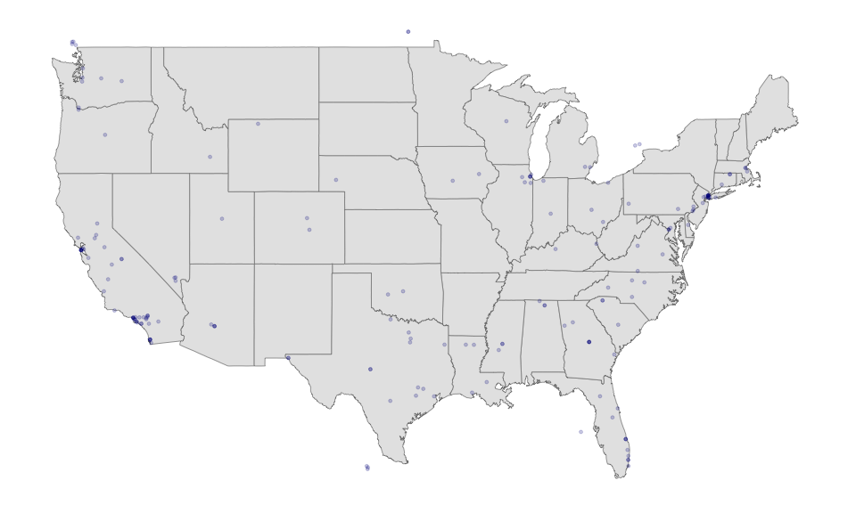

Twitter’s Streaming API
================

#### Authenticating

Before we can start collecting Twitter data, we need to create an OAuth
token that will allow us to authenticate our connection and access our
personal data.

After the new API changes, getting a new token requires submitting an
application for a developer account, which may take a few days. So for
now we will assume that we have access to one. See the instructions at
the end of the file for how to create yours once your application is
approved. We’ll come back to this during the seminars this week.

This will not work in your computer\!

``` r
library("ROAuth")
load("my_oauth.rda")
```

Once you have created your token (after your application has been
approved), you can check that it worked by running the line below:

``` r
library("tweetscores")
```

    ## Loading required package: R2WinBUGS

    ## Loading required package: coda

    ## Loading required package: boot

    ## ##
    ## ## tweetscores: tools for the analysis of Twitter data

    ## ## Pablo Barbera (USC)

    ## ## www.tweetscores.com
    ## ##

``` r
getUsers(screen_names="LSEnews", oauth = my_oauth)[[1]]$screen_name
```

    ## [1] "LSEnews"

If this displays `LSEnews` then we’re good to go\!

Some of the functions below will work with more than one token. If you
want to save multiple tokens, see the instructions at the end of the
file.

#### Collecting data from Twitter’s Streaming API

Collecting tweets filtering by
keyword:

``` r
library("streamR")
```

    ## Loading required package: RCurl

    ## Loading required package: bitops

    ## Loading required package: rjson

    ## Loading required package: ndjson

``` r
filterStream(file.name = "trump-streaming-tweets.json", track = "trump", 
    timeout = 20, oauth = my_oauth)
```

    ## Capturing tweets...

    ## Connection to Twitter stream was closed after 20 seconds with up to 430 tweets downloaded.

Note the options: - `file.name` indicates the file in your disk where
the tweets will be downloaded  
\- `track` is the keyword(s) mentioned in the tweets we want to capture.
- `timeout` is the number of seconds that the connection will remain
open  
\- `oauth` is the OAuth token we are using

Once it has finished, we can open it in R as a data frame with the
`parseTweets`
    function

``` r
tweets <- parseTweets("trump-streaming-tweets.json")
```

    ## 570 tweets have been parsed.

``` r
tweets[1, ]
```

    ##                                                                                                                                                                                                                                                                        text
    ## 1 RT @Trumpet1984:Do you suffer from Donotrecallitis?\n\nSymptoms include:  Guilt, desire to not perjure yourself, fact avoidance, loss of spine, Republicanism\n\nIf so, you might need Prizon®\n\nAsk your lawyer if Prizon® is right for you!\n\nhttps://t.co/2xnPlE62Pm
    ##   retweet_count favorite_count favorited truncated              id_str
    ## 1           369            999     FALSE     FALSE 1194901138082058241
    ##   in_reply_to_screen_name
    ## 1                    <NA>
    ##                                                                               source
    ## 1 <a href="http://twitter.com/download/iphone" rel="nofollow">Twitter for iPhone</a>
    ##   retweeted                     created_at in_reply_to_status_id_str
    ## 1     FALSE Thu Nov 14 08:53:26 +0000 2019                      <NA>
    ##   in_reply_to_user_id_str lang listed_count verified location user_id_str
    ## 1                    <NA>   en            2    FALSE     <NA>    25665768
    ##                                                                                                                                                   description
    ## 1 \U0001f5fdCongress do your job impeach the criminal. It’s not wrong to call POTUS a mofo. it’s wrong to call this mofo a POTUS. #resistance \U0001f308 #ifb
    ##   geo_enabled                user_created_at statuses_count
    ## 1        TRUE Sat Mar 21 11:59:33 +0000 2009          31830
    ##   followers_count favourites_count protected user_url
    ## 1            3132            25562     FALSE     <NA>
    ##                          name time_zone user_lang utc_offset friends_count
    ## 1 Pickle as in we are in a...        NA        NA         NA          4458
    ##      screen_name country_code country place_type full_name place_name
    ## 1 fight4freeAmer         <NA>    <NA>         NA      <NA>       <NA>
    ##   place_id place_lat place_lon lat lon expanded_url  url
    ## 1     <NA>       NaN       NaN  NA  NA         <NA> <NA>

If we want, we could also export it to a csv file to be opened later
with
Excel

``` r
write.csv(tweets, file = "trump-streaming-tweets.csv", row.names = FALSE)
```

And this is how we would capture tweets mentioning multiple keywords:

``` r
filterStream(file.name = "politics-tweets.json", 
    track=c("impeachment", "hearings", "trump"),
    timeout = 20, oauth = my_oauth)
```

We now turn to tweets collect filtering by location instead. To be able
to apply this type of filter, we need to set a geographical box and
collect only the tweets that are coming from that area.

For example, imagine we want to collect tweets from the United States.
The way to do it is to find two pairs of coordinates (longitude and
latitude) that indicate the southwest corner AND the northeast corner.
Note the reverse order: it’s not (lat, long), but (long, lat).

In the case of the US, it would be approx. (-125,25) and (-66,50). How
to find these coordinates? You can use Google Maps, and right-click on
the desired location. (Just note that long and lat are reversed
here\!)

``` r
filterStream(file.name="tweets_geo.json", locations=c(-125, 25, -66, 50), 
    timeout = 30, oauth = my_oauth)
```

    ## Capturing tweets...

    ## Connection to Twitter stream was closed after 30 seconds with up to 94 tweets downloaded.

We can do as before and open the tweets in R

``` r
tweets <- parseTweets("tweets_geo.json")
```

    ## 183 tweets have been parsed.

And use the maps library to see where most tweets are coming from. Note
that there are two types of geographic information on tweets:
`lat`/`lon` (from geolocated tweets) and `place_lat` and `place_lon`
(from tweets with place information). We will work with whatever is
available.

``` r
library("maps")
tweets$lat <- ifelse(is.na(tweets$lat), tweets$place_lat, tweets$lat)
tweets$lon <- ifelse(is.na(tweets$lon), tweets$place_lon, tweets$lon)
tweets <- tweets[!is.na(tweets$lat),]
states <- map.where("state", tweets$lon, tweets$lat)
head(sort(table(states), decreasing = TRUE))
```

    ## states
    ##         california              texas            florida 
    ##                 44                 14                 11 
    ##            georgia           illinois new york:manhattan 
    ##                  7                  7                  6

We can also prepare a map of the exact locations of the tweets.

``` r
library("ggplot2")

## First create a data frame with the map data 
map.data <- map_data("state")

# And we use ggplot2 to draw the map:
# 1) map base
ggplot(map.data) + geom_map(aes(map_id = region), map = map.data, fill = "grey90", 
    color = "grey50", size = 0.25) + expand_limits(x = map.data$long, y = map.data$lat) + 
    # 2) limits for x and y axis
    scale_x_continuous(limits=c(-125,-66)) + scale_y_continuous(limits=c(25,50)) +
    # 3) adding the dot for each tweet
    geom_point(data = tweets, 
    aes(x = lon, y = lat), size = 1, alpha = 1/5, color = "darkblue") +
    # 4) removing unnecessary graph elements
    theme(axis.line = element_blank(), 
        axis.text = element_blank(), 
        axis.ticks = element_blank(), 
        axis.title = element_blank(), 
        panel.background = element_blank(), 
        panel.border = element_blank(), 
        panel.grid.major = element_blank(), 
        panel.grid.minor = element_blank(), 
        plot.background = element_blank()) 
```

<!-- -->

Finally, it’s also possible to collect a random sample of tweets. That’s
what the “sampleStream” function
does:

``` r
sampleStream(file.name="tweets_random.json", timeout = 30, oauth = my_oauth)
```

    ## Capturing tweets...

    ## Connection to Twitter stream was closed after 30 seconds with up to 1667 tweets downloaded.

Here we are collecting 30 seconds of tweets. And once again, to open the
tweets in R…

``` r
tweets <- parseTweets("tweets_random.json")
```

    ## 2280 tweets have been parsed.

What is the most retweeted
    tweet?

``` r
tweets[which.max(tweets$retweet_count), ]
```

    ##                                                                          text
    ## 2057 RT @BTS_twt: 그리고 지민씨도 피해갈 수 없습니다. https://t.co/RDTNynQm5y
    ##      retweet_count favorite_count favorited truncated              id_str
    ## 2057        641705        1719726     FALSE     FALSE 1194902901761679360
    ##      in_reply_to_screen_name
    ## 2057                    <NA>
    ##                                                                                  source
    ## 2057 <a href="http://twitter.com/download/iphone" rel="nofollow">Twitter for iPhone</a>
    ##      retweeted                     created_at in_reply_to_status_id_str
    ## 2057     FALSE Thu Nov 14 09:00:26 +0000 2019                      <NA>
    ##      in_reply_to_user_id_str lang listed_count verified        location
    ## 2057                    <NA>   ko            0    FALSE Zürich, Schweiz
    ##              user_id_str
    ## 2057 1023524853813530626
    ##                                                         description
    ## 2057 @BTS_twt makes me h\ua67c̈a\ua67c̈p\ua67c̈p\ua67c̈y\ua67c̈ everyday
    ##      geo_enabled                user_created_at statuses_count
    ## 2057        TRUE Sun Jul 29 11:05:16 +0000 2018            525
    ##      followers_count favourites_count protected user_url              name
    ## 2057              21             2705     FALSE     <NA> Lejindary Bangtan
    ##      time_zone user_lang utc_offset friends_count     screen_name
    ## 2057        NA        NA         NA            40 BtsArmyLove_twt
    ##      country_code country place_type full_name place_name place_id
    ## 2057         <NA>    <NA>         NA      <NA>       <NA>     <NA>
    ##      place_lat place_lon lat lon expanded_url  url
    ## 2057       NaN       NaN  NA  NA         <NA> <NA>

What are the most popular hashtags at the moment? We’ll use regular
expressions to extract hashtags.

``` r
library("stringr")
ht <- str_extract_all(tweets$text, '#[A-Za-z0-9_]+')
ht <- unlist(ht)
head(sort(table(ht), decreasing = TRUE))
```

    ## ht
    ##           #GOT7          #Peing #HipWithMamamoo       #MAMAVOTE 
    ##              13              11               8               8 
    ##              #G            #NHK 
    ##               7               6

#### Creating your own token

Follow these steps to create your own token after your application has
been approved:

1.  Go to <https://developer.twitter.com/en/apps> and sign in.  
2.  If you don’t have a developer account, you will need to apply for
    one first. Fill in the application form and wait for a response.
3.  Once it’s approved, click on “Create New App”. You will need to have
    a phone number associated with your account in order to be able to
    create a token.  
4.  Fill name, description, and website (it can be anything, even
    <http://www.google.com>). Make sure you leave ‘Callback URL’ empty.
5.  Agree to user conditions.  
6.  From the “Keys and Access Tokens” tab, copy consumer key and
    consumer secret and paste below
7.  Click on “Create my access token”, then copy and paste your access
    token and access token secret below

<!-- end list -->

``` r
library(ROAuth)
my_oauth <- list(consumer_key = "CONSUMER_KEY",
   consumer_secret = "CONSUMER_SECRET",
   access_token="ACCESS_TOKEN",
   access_token_secret = "ACCESS_TOKEN_SECRET")
save(my_oauth, file="my_oauth.rda")
```

To access this data, then you just need to run:

``` r
load("my_oauth.rda")
```

What can go wrong here? Make sure all the consumer and token keys are
pasted here as is, without any additional space character. If you don’t
see any output in the console after running the code above, that’s a
good sign.

Note that the Oauth tokens data is saved as a local file. That will save
us some time later on, but you could also just re-run the code in lines
22 to 27 before connecting to the API in the future.

Note that you will need also to install the **tweetscores** and the
development version of **streamR** package from GitHub. You can do this
using this
code:

``` r
devtools::install_github("pablobarbera/twitter_ideology/pkg/tweetscores")
devtools::install_github("pablobarbera/streamR/streamR")
```

To check that it worked, try running the line below:

``` r
library("tweetscores")
getUsers(screen_names = "LSEnews", oauth = my_oauth)[[1]]$screen_name
```

    ## [1] "LSEnews"

If this displays `LSEnews` then we’re good to go\!
