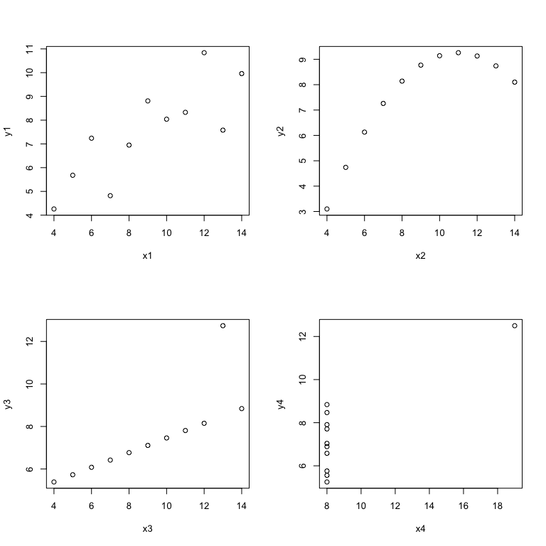

MY472 - Anscombe’s Quartet
================
Week 9, LSE MY472

An example of how summary statistics of a dataset can be misleading:

Four seemingly identical pairs of vectors.

``` r
attach(anscombe)
mean(x1)
```

    ## [1] 9

``` r
mean(x2)
```

    ## [1] 9

``` r
mean(x3)
```

    ## [1] 9

``` r
mean(x4)
```

    ## [1] 9

``` r
mean(y1)
```

    ## [1] 7.500909

``` r
mean(y2)
```

    ## [1] 7.500909

``` r
mean(y3)
```

    ## [1] 7.5

``` r
mean(y4)
```

    ## [1] 7.500909

…that seem to be related in the same way.

``` r
cor(x1, y1)
```

    ## [1] 0.8164205

``` r
cor(x2, y2)
```

    ## [1] 0.8162365

``` r
cor(x3, y3)
```

    ## [1] 0.8162867

``` r
cor(x4, y4)
```

    ## [1] 0.8165214

``` r
lm(y1 ~ x1)
```

    ## 
    ## Call:
    ## lm(formula = y1 ~ x1)
    ## 
    ## Coefficients:
    ## (Intercept)           x1  
    ##      3.0001       0.5001

``` r
lm(y2 ~ x2)
```

    ## 
    ## Call:
    ## lm(formula = y2 ~ x2)
    ## 
    ## Coefficients:
    ## (Intercept)           x2  
    ##       3.001        0.500

``` r
lm(y3 ~ x3)
```

    ## 
    ## Call:
    ## lm(formula = y3 ~ x3)
    ## 
    ## Coefficients:
    ## (Intercept)           x3  
    ##      3.0025       0.4997

``` r
lm(y4 ~ x4)
```

    ## 
    ## Call:
    ## lm(formula = y4 ~ x4)
    ## 
    ## Coefficients:
    ## (Intercept)           x4  
    ##      3.0017       0.4999

But are they?

``` r
par(mfrow=(c(2,2)))
plot(x1, y1)
plot(x2, y2)
plot(x3, y3)
plot(x4, y4)
```

<!-- -->
