ggplot2 basics: grammar of graphics, geom types
================
Week 9, LSE MY472

## Data preparation

In the examples below, we’ll be working with a random sample of 10,000
public Facebook posts by Members of the U.S. Congress. The overall
question that we will be trying to answer is: what type of posts gets
more likes?

``` r
library(DBI)
db <- dbConnect(RSQLite::SQLite(), "data/facebook-db-mini.sqlite")

df <- dbGetQuery(db, 
                 "SELECT posts.screen_name, date, posts.type AS post_type, 
                      message, likes_count, comments_count, shares_count,
                      love_count, haha_count, wow_count, angry_count,
                      sad_count, gender, congress.type, party
                 FROM posts JOIN congress
                 ON congress.screen_name = posts.screen_name
                 ORDER BY RANDOM()
                 LIMIT 10000")
```

    ## Warning in result_fetch(res@ptr, n = n): Column `screen_name`: mixed type, first
    ## seen values of type string, coercing other values of type real

``` r
# also available as:
df <- read.csv("data/fb-congress-data.csv", stringsAsFactors=FALSE)
```

And now we load the **ggplot2** package:

``` r
library(ggplot2)
```

## Univariate analysis for a single continuous variable

``` r
# base layer
p <- ggplot(df, aes(x=likes_count))

# histogram
p + geom_histogram() ## histogram of likes for each post
```

    ## `stat_bin()` using `bins = 30`. Pick better value with `binwidth`.

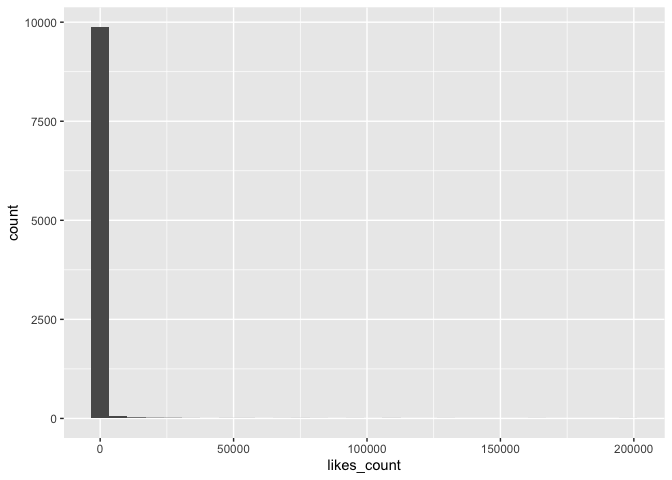<!-- -->

``` r
# density plot
p + geom_density() ## density of likes for each post
```

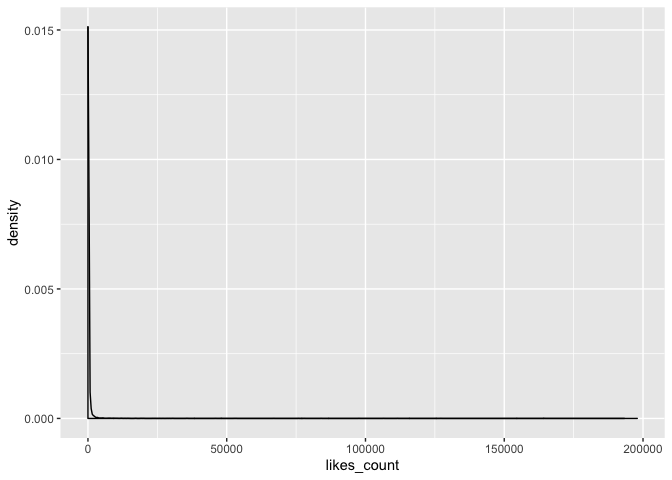<!-- -->

``` r
# transforming scale to log10
p + geom_histogram() + scale_x_log10()
```

    ## Warning: Transformation introduced infinite values in continuous x-axis

    ## `stat_bin()` using `bins = 30`. Pick better value with `binwidth`.

    ## Warning: Removed 22 rows containing non-finite values (stat_bin).

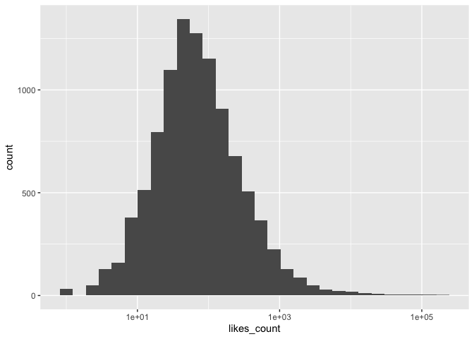<!-- -->

``` r
p + geom_density() + scale_x_log10()
```

    ## Warning: Transformation introduced infinite values in continuous x-axis

    ## Warning: Removed 22 rows containing non-finite values (stat_density).

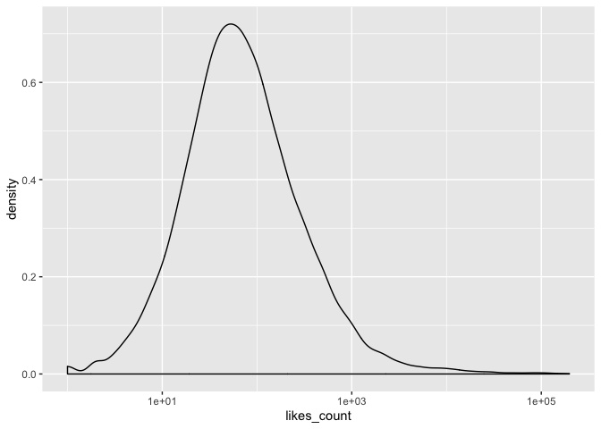<!-- -->

``` r
# why does this line of code drops some observations?
```

## Univariate analysis for a single categorical variable

``` r
p <- ggplot(df, aes(x=post_type))

# bar chart
p + geom_bar() ## number of posts by type
```

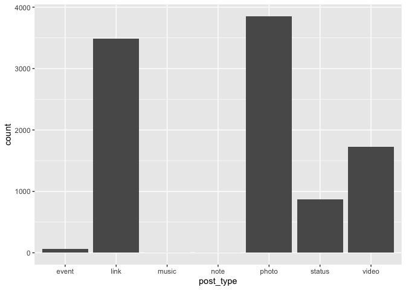<!-- -->

``` r
# bar chart (horizontal)
p + geom_bar() + coord_flip()
```

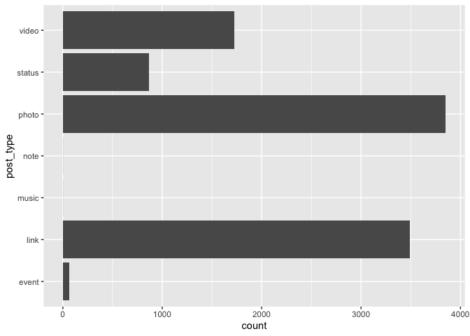<!-- -->

## Bivariate analysis for two continuous variables

``` r
# base layer
p <- ggplot(df, aes(x=likes_count, y=comments_count))

# scatter plot
p + geom_point() ## relationship between number of likes and number of comments
```

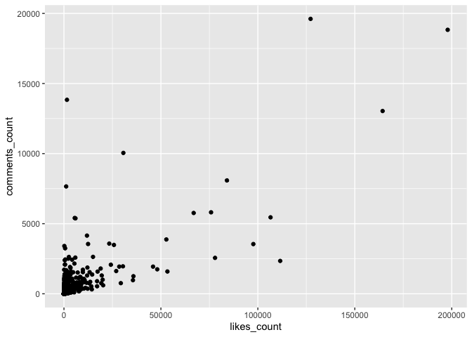<!-- -->

``` r
p + geom_point() + scale_x_log10() + scale_y_log10() ## log scales
```

    ## Warning: Transformation introduced infinite values in continuous x-axis

    ## Warning: Transformation introduced infinite values in continuous y-axis

<!-- -->

``` r
p + geom_point() + stat_smooth(na.rm=T) 
```

    ## `geom_smooth()` using method = 'gam' and formula 'y ~ s(x, bs = "cs")'

<!-- -->

``` r
p + geom_point() + scale_x_log10() + scale_y_log10() + 
    stat_smooth()
```

    ## Warning: Transformation introduced infinite values in continuous x-axis
    
    ## Warning: Transformation introduced infinite values in continuous y-axis

    ## Warning: Transformation introduced infinite values in continuous x-axis

    ## Warning: Transformation introduced infinite values in continuous y-axis

    ## `geom_smooth()` using method = 'gam' and formula 'y ~ s(x, bs = "cs")'

    ## Warning: Removed 652 rows containing non-finite values (stat_smooth).

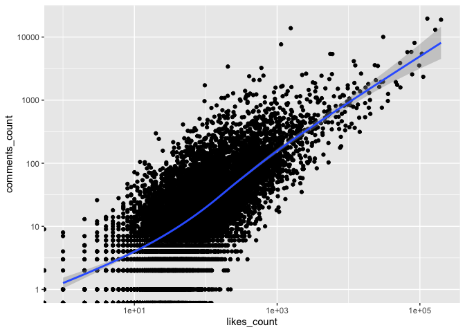<!-- -->

Another example, but this time with a line plot

``` r
counts <- dbGetQuery(db, 
                     "SELECT date, COUNT(1) as post_count
                     FROM posts 
                     GROUP BY date
                     ORDER BY date")

p <- ggplot(counts, aes(x=as.Date(date), y=post_count))
p + geom_line() ## line: posts per day
```

<!-- -->

## Bivariate analysis for one continuous variable and one categorical variable

``` r
p <- ggplot(df, aes(x=post_type, y=likes_count))
p + geom_boxplot() ## number of likes by type of post
```

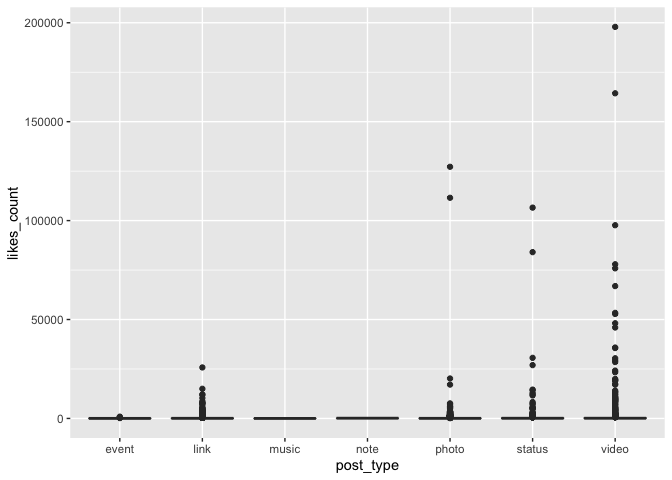<!-- -->

``` r
p + geom_boxplot() + scale_y_log10()
```

    ## Warning: Transformation introduced infinite values in continuous y-axis

    ## Warning: Removed 22 rows containing non-finite values (stat_boxplot).

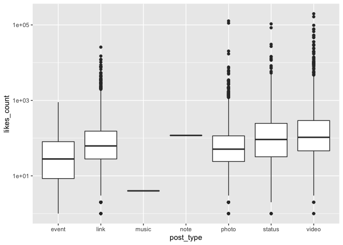<!-- -->

``` r
p + geom_violin() + scale_y_log10()
```

    ## Warning: Transformation introduced infinite values in continuous y-axis

    ## Warning: Removed 22 rows containing non-finite values (stat_ydensity).

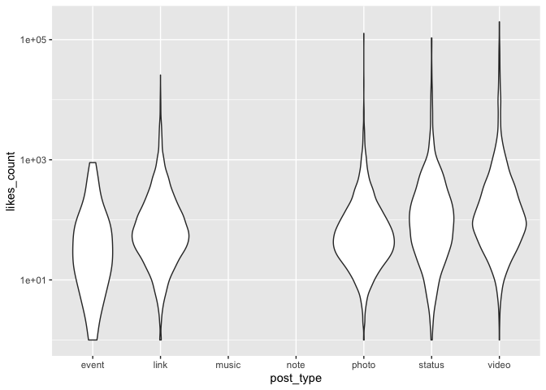<!-- -->

``` r
p <- ggplot(df, aes(x=likes_count)) ## same with density plot
p + geom_density(aes(color=party)) + scale_x_log10()
```

    ## Warning: Transformation introduced infinite values in continuous x-axis

    ## Warning: Removed 22 rows containing non-finite values (stat_density).

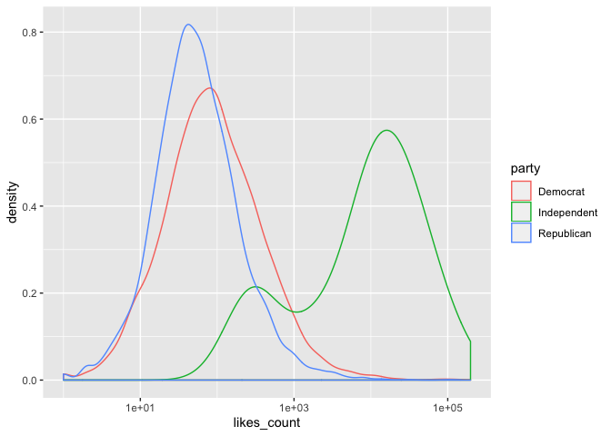<!-- -->

## Bivariate analysis for two categorical variables

``` r
counts <- dbGetQuery(db, 
                     "SELECT posts.type, congress.party, 
                        COUNT(1) AS post_count
                     FROM posts JOIN congress
                     ON congress.screen_name = posts.screen_name
                     WHERE party != 'Independent'
                     GROUP BY posts.type, congress.party")

p <- ggplot(counts, aes(x=party, y=type))
p + geom_tile(aes(fill=post_count))
```

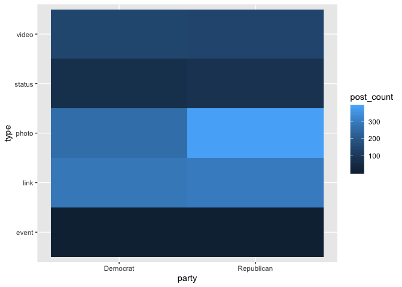<!-- -->

## Multivariate analysis for three continuous variables

``` r
p <- ggplot(df, aes(x=likes_count, y=comments_count, color=log(angry_count)))

p + geom_point()
```

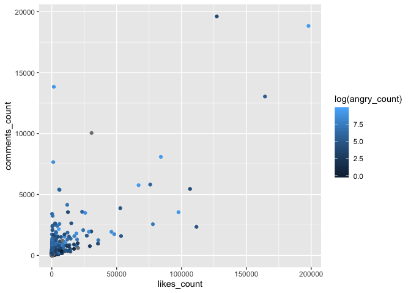<!-- -->

``` r
p + geom_point() + scale_y_log10() + scale_x_log10() + 
  stat_smooth(method="lm")
```

    ## Warning: Transformation introduced infinite values in continuous y-axis

    ## Warning: Transformation introduced infinite values in continuous x-axis

    ## Warning: Transformation introduced infinite values in continuous y-axis

    ## Warning: Transformation introduced infinite values in continuous x-axis

    ## Warning: Removed 652 rows containing non-finite values (stat_smooth).

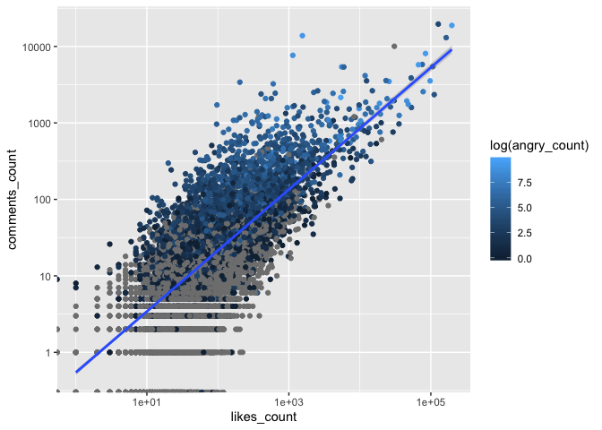<!-- -->

## Multivariate analysis for two continuous variables and one categorical variable

``` r
p <- ggplot(df, aes(x=likes_count, y=comments_count))
p + geom_point() + scale_x_log10() + scale_y_log10() + 
        facet_wrap(~post_type, nrow=2) ## grid of plots: 2x4, by post type
```

    ## Warning: Transformation introduced infinite values in continuous x-axis

    ## Warning: Transformation introduced infinite values in continuous y-axis

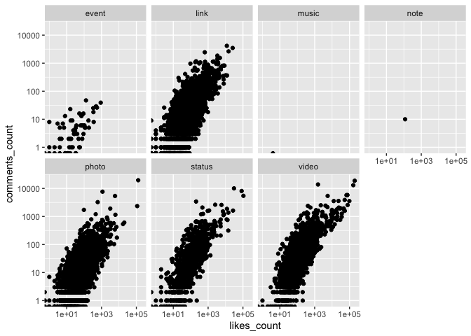<!-- -->

``` r
p <- ggplot(df[df$likes_count>10000,], 
            aes(x=likes_count, y=comments_count, label=party))
p + geom_text() + scale_x_log10() + scale_y_log10()
```

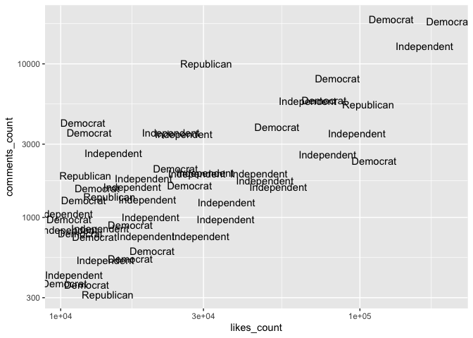<!-- -->

``` r
        ## geom_text() to use party names instead of points
```

Another example, using time and counts by party:

``` r
## counting number of posts by party and day
counts <- dbGetQuery(db, 
                     "SELECT SUBSTR(posts.date, 1, 7) AS month, 
                        congress.party, 
                        COUNT(1) AS post_count
                     FROM posts JOIN congress
                     ON congress.screen_name = posts.screen_name
                     WHERE party != 'Independent'
                     GROUP BY month, congress.party")

p <- ggplot(counts, aes(x=as.Date(paste0(month, '-01')), 
                        y=post_count, group=party))
p + geom_line(aes(color=party)) +
  scale_color_manual(values=c("blue", "red"))
```

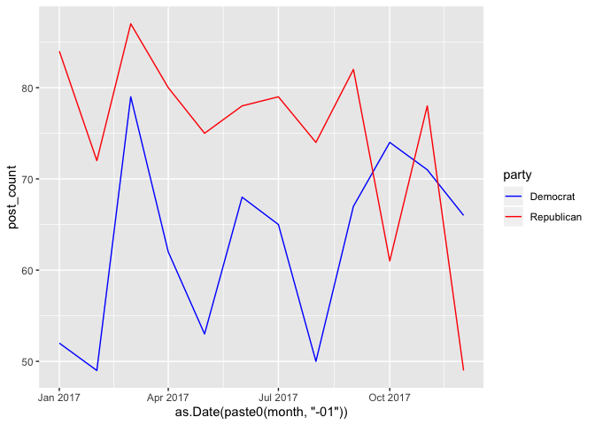<!-- -->

``` r
## line: posts per month, by party
```

Other examples:

``` r
## scatter plot with dots colored by type of post
p <- ggplot(df[df$likes_count>5000,], 
            aes(x=likes_count, y=comments_count))
p + geom_point(aes(color=post_type)) + scale_x_log10() + scale_y_log10()
```

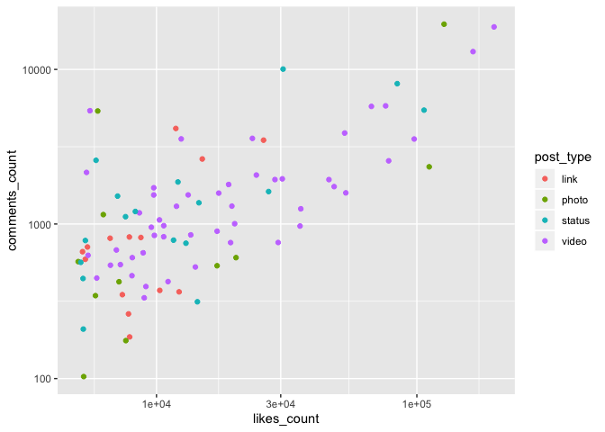<!-- -->

``` r
## same for point shape
p <- ggplot(df[df$likes_count>5000,], 
            aes(x=likes_count, y=comments_count))
p + geom_point(aes(shape=post_type)) + scale_x_log10() + scale_y_log10()
```

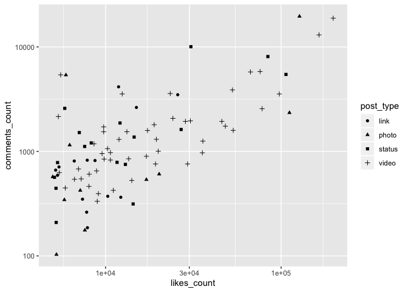<!-- -->

``` r
## combining both
p <- ggplot(df[df$likes_count>5000,], 
            aes(x=likes_count, y=comments_count))
p + geom_point(aes(shape=post_type, color=post_type)) + scale_x_log10() + scale_y_log10()
```

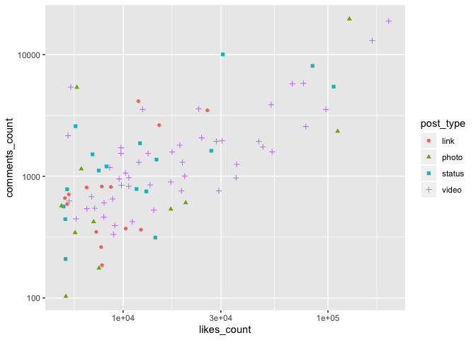<!-- -->

``` r
## this can be very easily extended to multiple scales
p <- ggplot(df[df$likes_count>5000,], 
            aes(x=likes_count, y=comments_count))
p + geom_point(aes(shape=gender, color=post_type, size=shares_count)) + 
        scale_x_log10() + scale_y_log10() + scale_size(trans="log10") +
        facet_wrap(~post_type, nrow=2)   
```

    ## Warning: Transformation introduced infinite values in discrete y-axis

    ## Warning in sqrt(x): NaNs produced

    ## Warning: Removed 2 rows containing missing values (geom_point).

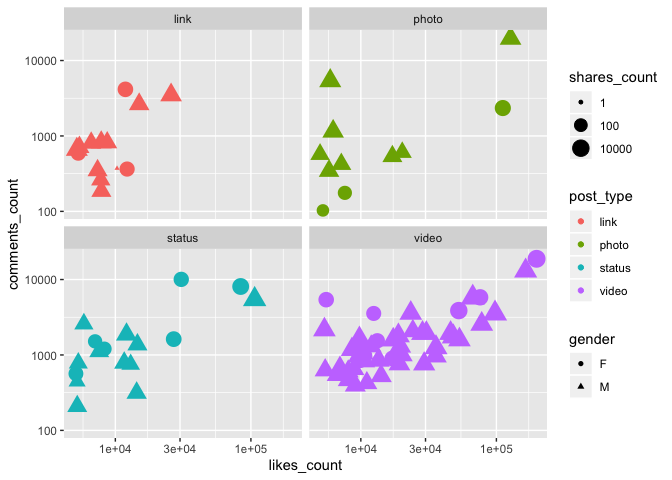<!-- -->

## Dealing with overfitting issues

``` r
# baseline
p <- ggplot(df, aes(x=likes_count, y=comments_count))
p + geom_point() + scale_x_log10() + scale_y_log10() 
```

    ## Warning: Transformation introduced infinite values in continuous x-axis

    ## Warning: Transformation introduced infinite values in continuous y-axis

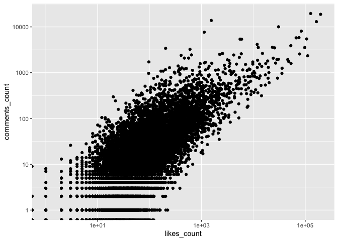<!-- -->

``` r
## jittering points (useful for counts)
p <- ggplot(df, aes(x=likes_count, y=comments_count))
p + geom_jitter(position = position_jitter(width = .5, height=.5)) + 
    scale_x_log10() + scale_y_log10() 
```

    ## Warning: Transformation introduced infinite values in continuous x-axis
    
    ## Warning: Transformation introduced infinite values in continuous y-axis

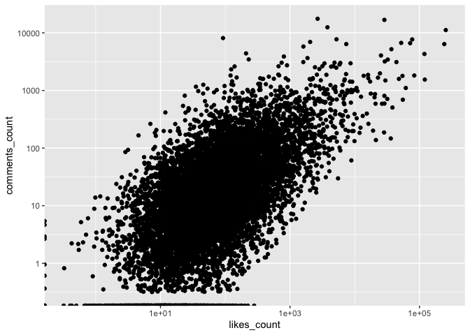<!-- -->

``` r
## transparency
p <- ggplot(df, aes(x=likes_count, y=comments_count))
p + geom_jitter(position = position_jitter(width = .5, height=.5), alpha=1/25) + 
    scale_x_log10() + scale_y_log10()
```

    ## Warning: Transformation introduced infinite values in continuous x-axis
    
    ## Warning: Transformation introduced infinite values in continuous y-axis

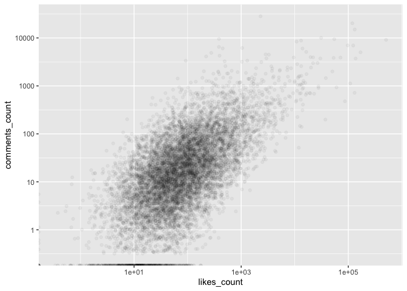<!-- -->

``` r
## hexbin
p <- ggplot(df[df$likes_count>0 & df$comments_count>0,], 
        aes(x=likes_count, y=comments_count))
p + geom_hex() + scale_x_log10() + scale_y_log10() + 
    scale_fill_continuous(trans="log10")
```

    ## Warning: Computation failed in `stat_binhex()`:
    ## Package `hexbin` required for `stat_binhex`.
    ## Please install and try again.

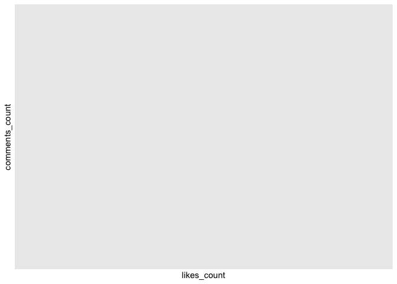<!-- -->
