ggplot2 basics: axes, scales, legends, polishing plots
================
Week 9, LSE MY472

## Data preparation (continued)

In the examples below, we’ll be working with a random sample of 10,000
public Facebook posts by Members of the U.S. Congress. The overall
question that we will be trying to answer is: what type of posts gets
more likes?

``` r
library("DBI")
db <- dbConnect(RSQLite::SQLite(), "data/facebook-db-mini.sqlite")

df <- dbGetQuery(db, 
                 "SELECT posts.screen_name, date, posts.type AS post_type, 
                      message, likes_count, comments_count, shares_count,
                      love_count, haha_count, wow_count, angry_count,
                      sad_count, gender, congress.type, party
                 FROM posts JOIN congress
                 ON congress.screen_name = posts.screen_name
                 ORDER BY RANDOM()
                 LIMIT 10000")
```

    ## Warning in result_fetch(res@ptr, n = n): Column `screen_name`: mixed type, first
    ## seen values of type string, coercing other values of type real

``` r
# also available as:
df <- read.csv("data/fb-congress-data.csv", stringsAsFactors = FALSE)
```

And now we load the **ggplot2** package:

``` r
library("ggplot2")
```

## Customizing axes

``` r
# changing axis titles
p <- ggplot(df, aes(x=likes_count))
p + geom_histogram() + scale_x_log10("Number of likes") +
    scale_y_continuous("Post count")
```

    ## Warning: Transformation introduced infinite values in continuous x-axis

    ## `stat_bin()` using `bins = 30`. Pick better value with `binwidth`.

    ## Warning: Removed 22 rows containing non-finite values (stat_bin).

<!-- -->

``` r
# changing axis limits (continuous variables)
p + geom_histogram() + scale_y_continuous("Post count") +
  scale_x_log10("Number of likes", limits=c(1, 100000)) ## in log scale
```

    ## Warning: Transformation introduced infinite values in continuous x-axis

    ## `stat_bin()` using `bins = 30`. Pick better value with `binwidth`.

    ## Warning: Removed 27 rows containing non-finite values (stat_bin).

    ## Warning: Removed 2 rows containing missing values (geom_bar).

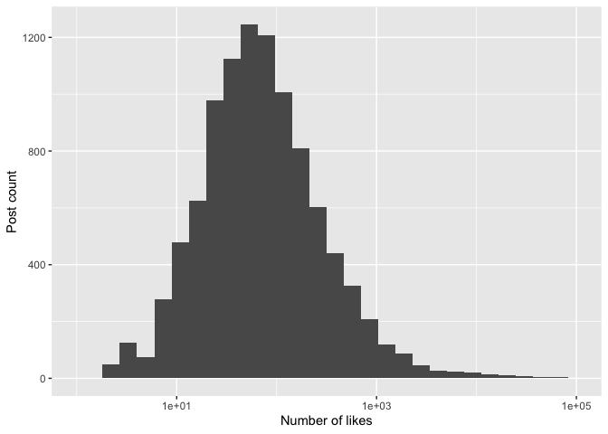<!-- -->

``` r
# changing axis breaks and labels
p <- ggplot(df, aes(x=likes_count))
p + geom_histogram() + scale_x_log10(breaks=c(1, 10, 100, 1000))
```

    ## Warning: Transformation introduced infinite values in continuous x-axis

    ## `stat_bin()` using `bins = 30`. Pick better value with `binwidth`.

    ## Warning: Removed 22 rows containing non-finite values (stat_bin).

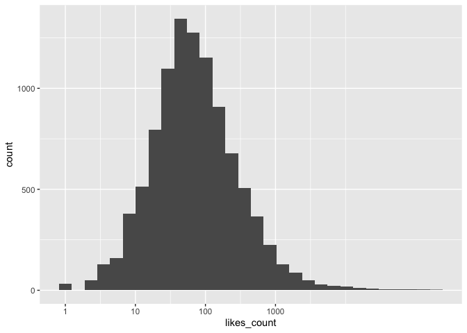<!-- -->

``` r
p + geom_histogram() + scale_x_log10(breaks=c(1, 10, 100, 1000, 10000),
    labels=c(1, 10, 100, "1K", "10K"))
```

    ## Warning: Transformation introduced infinite values in continuous x-axis

    ## `stat_bin()` using `bins = 30`. Pick better value with `binwidth`.

    ## Warning: Removed 22 rows containing non-finite values (stat_bin).

<!-- -->

``` r
# changing axis breaks and labels (categorical variables)
p <- ggplot(df, aes(x=party))
p + geom_bar() + scale_x_discrete(labels=c("D", "I", "R"))
```

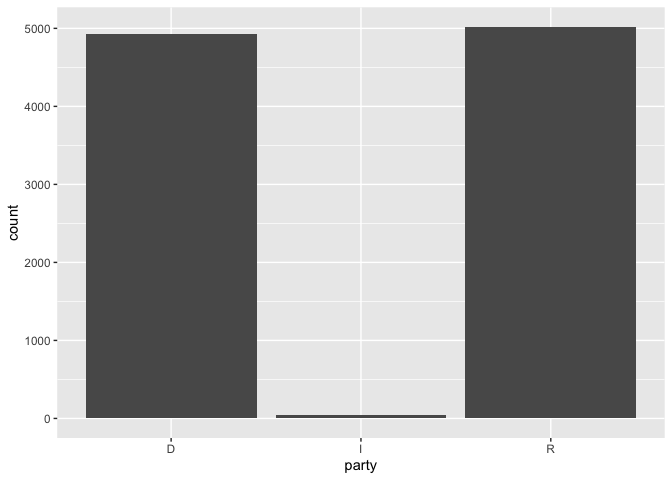<!-- -->

``` r
# changing axis breaks and labels (date variables)
counts <- dbGetQuery(db, 
                     "SELECT date, COUNT(1) as post_count
                     FROM posts 
                     GROUP BY date
                     ORDER BY date")

p <- ggplot(counts, aes(x=as.Date(date), y=post_count))
p + geom_line() ## line: posts per day
```

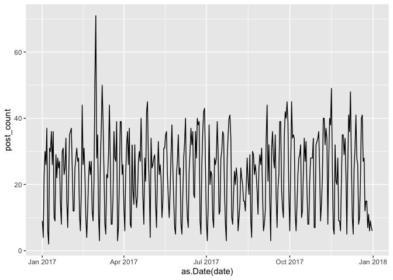<!-- -->

``` r
p + geom_line() + scale_x_date(date_breaks="2 months")
```

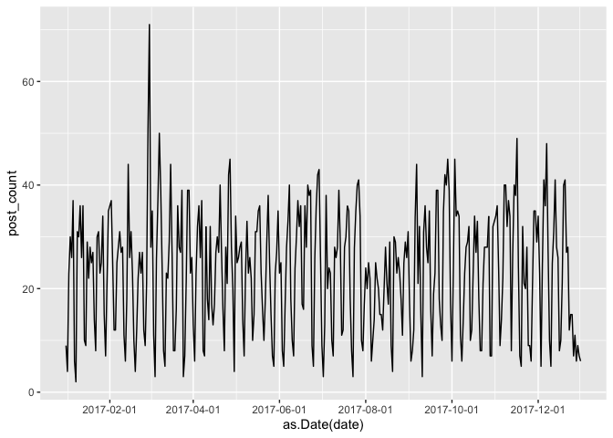<!-- -->

``` r
library(scales) # loading additional library scales
p + geom_line() + scale_x_date(date_breaks="2 months", 
    labels = date_format("%Y-%m"))
```

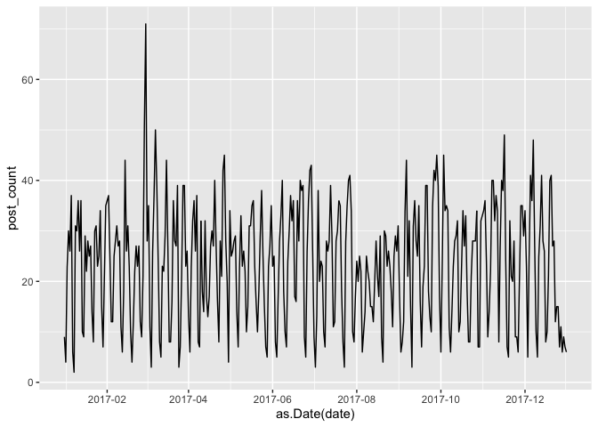<!-- -->

## Customizing scales (properties of geoms) and legends

Note that all the modifications below can be linked to a factor
variable, as in previous script, and then it becomes an aesthetics; or
it can go out as a property of the geom and then applied to all of them.

``` r
p <- ggplot(df, aes(x=likes_count))
p + scale_x_log10() + geom_histogram(color="red") # border of geoms
```

    ## Warning: Transformation introduced infinite values in continuous x-axis

    ## `stat_bin()` using `bins = 30`. Pick better value with `binwidth`.

    ## Warning: Removed 22 rows containing non-finite values (stat_bin).

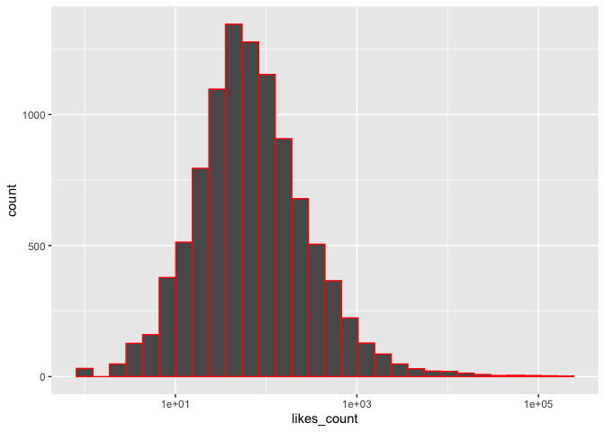<!-- -->

``` r
p + scale_x_log10() + geom_histogram(fill="red") # area of geoms
```

    ## Warning: Transformation introduced infinite values in continuous x-axis

    ## `stat_bin()` using `bins = 30`. Pick better value with `binwidth`.

    ## Warning: Removed 22 rows containing non-finite values (stat_bin).

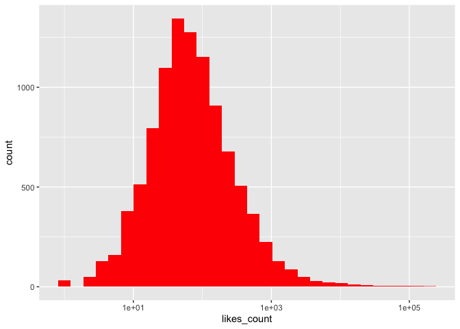<!-- -->

``` r
p <- ggplot(df, aes(x=likes_count, y=comments_count))
p + scale_x_log10() + scale_y_log10() + geom_point(color="red")
```

    ## Warning: Transformation introduced infinite values in continuous x-axis

    ## Warning: Transformation introduced infinite values in continuous y-axis

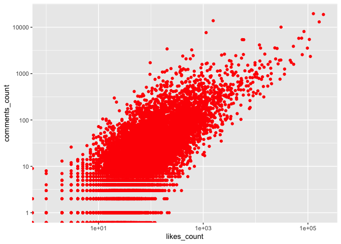<!-- -->

``` r
p + scale_x_log10() + scale_y_log10() + geom_point(shape=15)
```

    ## Warning: Transformation introduced infinite values in continuous x-axis
    
    ## Warning: Transformation introduced infinite values in continuous y-axis

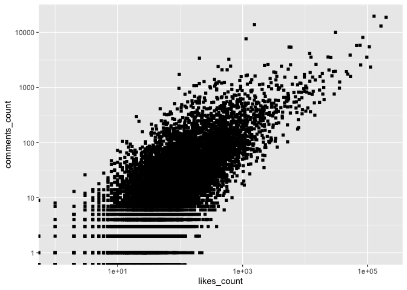<!-- -->

``` r
p + scale_x_log10() + scale_y_log10() + geom_point(size=1)
```

    ## Warning: Transformation introduced infinite values in continuous x-axis
    
    ## Warning: Transformation introduced infinite values in continuous y-axis

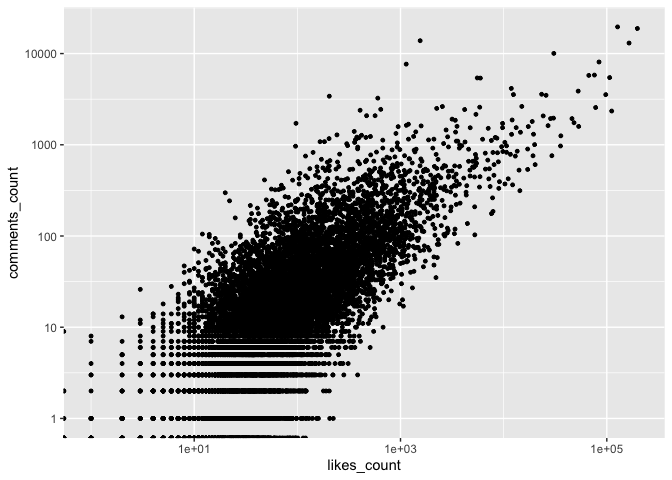<!-- -->

``` r
# for a complete list for each geom, type ?geom_point, ?geom_line, ...
```

Scales of aesthetics can also be modified manually very easily

``` r
p <- ggplot(df, aes(x=likes_count, y=comments_count))
p + geom_point(aes(color=post_type)) + scale_x_log10() + scale_y_log10() +
    scale_color_manual("Post type",
        limits = c("link", "status", "video", "photo"),
        values=c("blue", "grey", "red", "yellow"))
```

    ## Warning: Transformation introduced infinite values in continuous x-axis

    ## Warning: Transformation introduced infinite values in continuous y-axis

    ## Warning: Removed 66 rows containing missing values (geom_point).

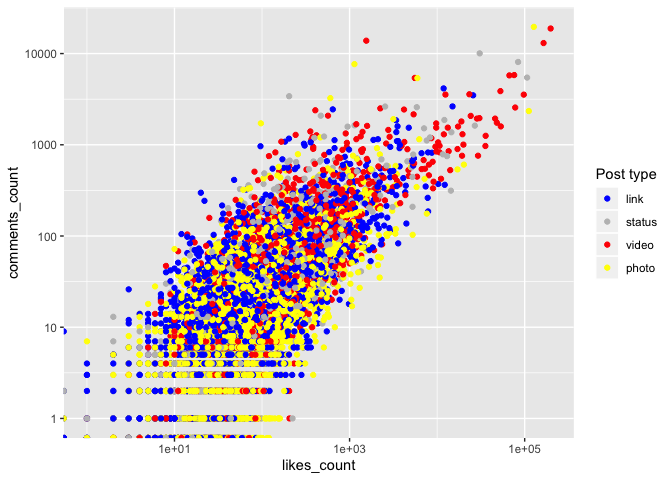<!-- -->

``` r
p + geom_point(aes(shape=post_type)) + scale_x_log10() + scale_y_log10() +
    scale_shape_manual("Post type",
        limits = c("link", "status", "video", "photo"),
        values=c(1, 3, 4, 5)) ## anything from 1 to 25
```

    ## Warning: Transformation introduced infinite values in continuous x-axis

    ## Warning: Transformation introduced infinite values in continuous y-axis

    ## Warning: Removed 66 rows containing missing values (geom_point).

<!-- -->

Finally, we can also modify the labels in the
legend:

``` r
p + geom_point(aes(shape=post_type)) + scale_x_log10() + scale_y_log10() +
    scale_shape_manual("Post type",
        limits = c("link", "status", "video", "photo"),
        labels = c("Link", "Status", "Video", "Photo"),
        values=c(1, 3, 4, 5)) ## anything from 1 to 25
```

    ## Warning: Transformation introduced infinite values in continuous x-axis

    ## Warning: Transformation introduced infinite values in continuous y-axis

    ## Warning: Removed 66 rows containing missing values (geom_point).

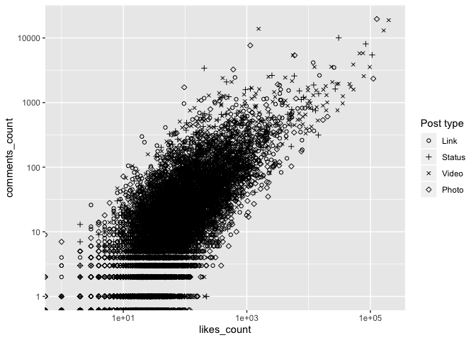<!-- -->

## Customizing facets

Multiple plots (1 factor variable):

``` r
p + geom_point() + scale_x_log10() + scale_y_log10() +
    facet_wrap(~post_type)
```

    ## Warning: Transformation introduced infinite values in continuous x-axis

    ## Warning: Transformation introduced infinite values in continuous y-axis

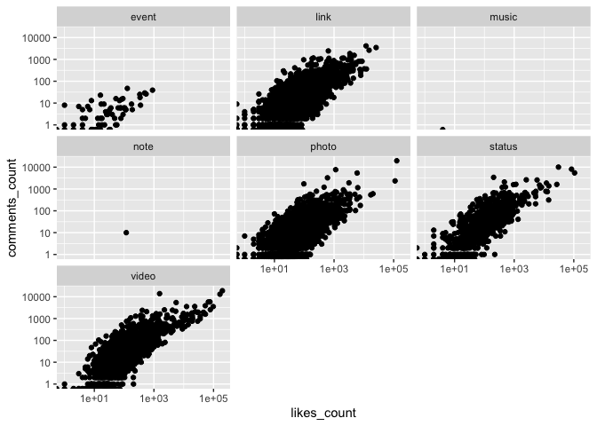<!-- -->

``` r
p + geom_point() + scale_x_log10() + scale_y_log10() +
    facet_wrap(~post_type, nrow=4)
```

    ## Warning: Transformation introduced infinite values in continuous x-axis
    
    ## Warning: Transformation introduced infinite values in continuous y-axis

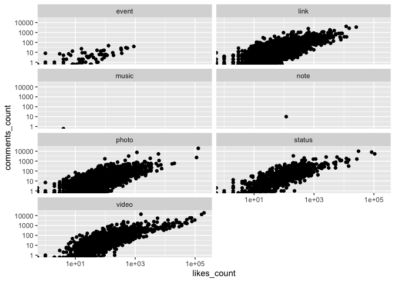<!-- -->

``` r
p + geom_point() + scale_x_log10() + scale_y_log10() +
    facet_wrap(~post_type, ncol=4)
```

    ## Warning: Transformation introduced infinite values in continuous x-axis
    
    ## Warning: Transformation introduced infinite values in continuous y-axis

<!-- -->

Multiple plots (2 factor variables)

``` r
p + geom_point() + scale_x_log10() + scale_y_log10() +
    facet_grid(gender~post_type)
```

    ## Warning: Transformation introduced infinite values in continuous x-axis

    ## Warning: Transformation introduced infinite values in continuous y-axis

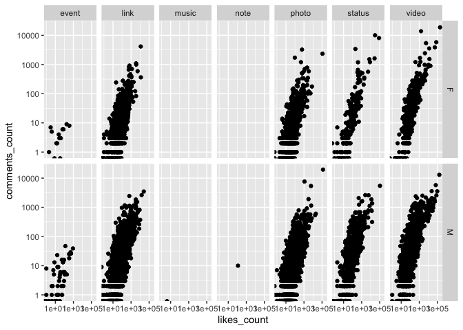<!-- -->

## Changing themes

``` r
p + geom_point() + scale_x_log10() + scale_y_log10() + theme_bw()
```

    ## Warning: Transformation introduced infinite values in continuous x-axis

    ## Warning: Transformation introduced infinite values in continuous y-axis

<!-- -->

``` r
p + geom_point() + scale_x_log10() + scale_y_log10() + theme_grey()
```

    ## Warning: Transformation introduced infinite values in continuous x-axis
    
    ## Warning: Transformation introduced infinite values in continuous y-axis

<!-- -->

``` r
p + geom_point() + scale_x_log10() + scale_y_log10() + theme_minimal()
```

    ## Warning: Transformation introduced infinite values in continuous x-axis
    
    ## Warning: Transformation introduced infinite values in continuous y-axis

<!-- -->

``` r
p + geom_point() + scale_x_log10() + scale_y_log10() + theme_classic()
```

    ## Warning: Transformation introduced infinite values in continuous x-axis
    
    ## Warning: Transformation introduced infinite values in continuous y-axis

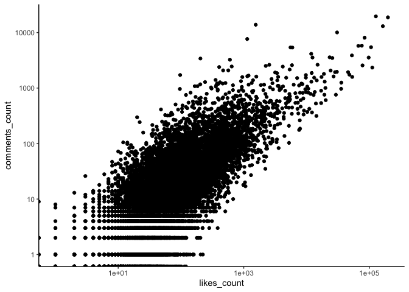<!-- -->

All theme options can be edited manually using ‘theme’, e.g.

``` r
p + geom_point() + scale_x_log10() + scale_y_log10() +
    theme( axis.ticks = element_blank() ) # removing axis ticks
```

    ## Warning: Transformation introduced infinite values in continuous x-axis

    ## Warning: Transformation introduced infinite values in continuous y-axis

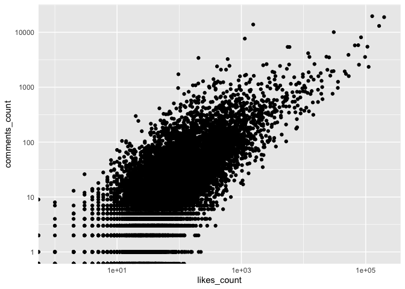<!-- -->

See `?theme` for all possible options. We will see more examples later.

## Saving plots

Different ways of doing this, easiest is with ‘ggsave’

``` r
pq <- p + geom_point() + scale_x_log10() + scale_y_log10() +
    facet_grid(party~gender)

ggsave(pq, file="grid_plot.pdf", height=6, width=6)
```

    ## Warning: Transformation introduced infinite values in continuous x-axis

    ## Warning: Transformation introduced infinite values in continuous y-axis

## Multiple types of plots on a grid

``` r
library(gridExtra) ## adds more functions to grid
```

``` r
# posts by type of post
p1 <- ggplot(df, aes(x=post_type)) + geom_bar() + theme_minimal() +
    scale_y_continuous("Number of posts") + 
    scale_x_discrete("Type of post") +
    theme (axis.ticks.x = element_blank())

p2 <- ggplot(df, aes(x=gender)) + geom_bar() + theme_minimal() +
     scale_x_discrete("Gender of legislator", 
        labels=c("Female", "Male")) +   
    theme (axis.title.y = element_blank(), axis.text.y = element_blank(),
        axis.ticks = element_blank())

# average number of likes by type of post
p3 <- ggplot(df, aes(x=post_type, y=likes_count)) + 
    stat_summary(fun.y="mean", geom="point", size=5, shape=15) +
    theme_minimal() + scale_y_continuous("Average likes count") +
    scale_x_discrete("Type of post") +
    theme (axis.ticks.x = element_blank()) 

# average number of likes by gender
p4 <- ggplot(df, aes(x=gender, y=likes_count)) + 
    stat_summary(fun.y="mean", geom="point", size=5, shape=15) +
    theme_minimal() + scale_x_discrete("Gender of legislator", 
        labels=c("Female", "Male")) +   
    theme (axis.title.y = element_blank(), axis.text.y = element_blank(),
        axis.ticks = element_blank())

pdf("multiple_plots_grid.pdf", height=6, width=6)
grid.arrange(arrangeGrob(p1, p2, p3, p4, ncol=2, heights=c(0.6, 0.4)))
dev.off()
```

    ## quartz_off_screen 
    ##                 2
