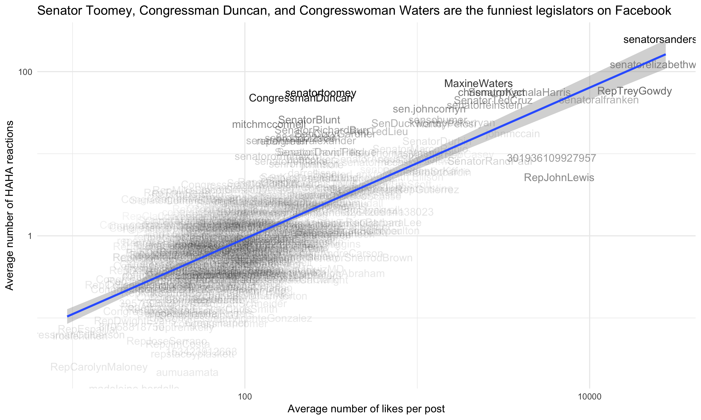
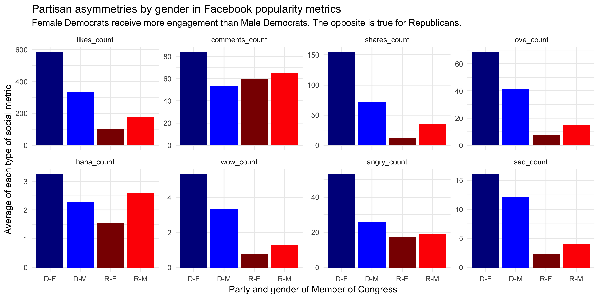
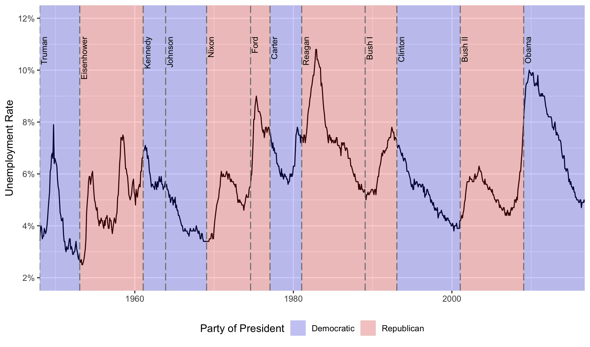
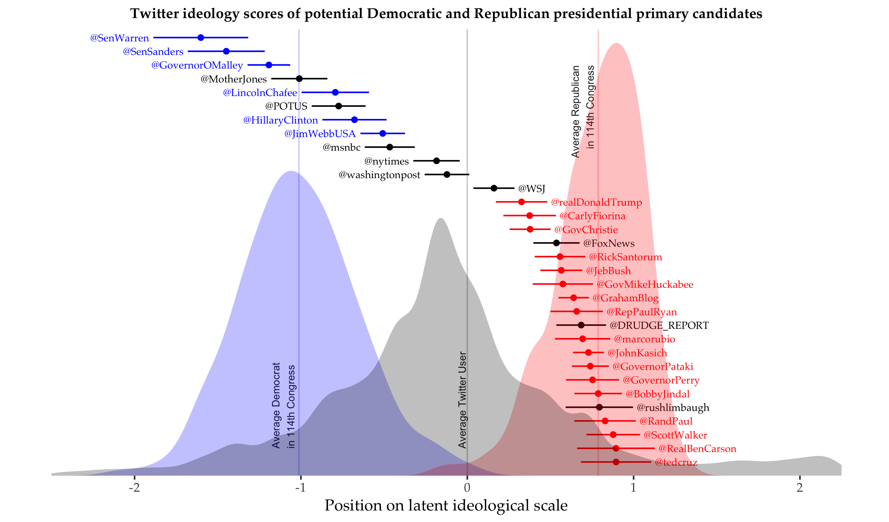

The goal of this week's class exercise will be to replicate four different graphs (of increasing difficulty!) done using ggplot2. How close do your plots get to the ones below?

```{r}
library(ggplot2)
library(scales)
library(ggthemes)
library(reshape2)
```

## 1. Who is the funniest legislator?

To answer this question, let's try to replicate the scatterplot below, where we try to identify outliers: legislators that receive many more HAHA reactions than we would expect based on the average number of likes that their posts receive.

Use the SQLite database with public Facebook data you created two weeks ago first to extract and clean the data. Then, iterate until you can replicate the scatterplot. The transparency of the names is a function of the residuals in a regression of the average haha_count on likes_count per Member of Congress.

```{r}
# your code here

```




## 2. Popularity metrics by party and gender

For this second exercise, you will have to produce a graph that displays the average popularity metrics of legislators grouped by gender and party. Note that this example involves some reshaping of the data, which you can do either in SQL or directly in R.

```{r}
df <- read.csv("fb-congress-data.csv", stringsAsFactors=FALSE)

# your code here

```




## 3. Unemployment in the US

Now you're asked to produce a line chart that displays the evolution in the unemployment rate in the US over time. The challenge here consists on overlaying a set of shaded boxes in red or blue, depending on the party to which the president in power at the time belongs. To help with that part, you can see below how to create a data frame with the relevant information.

```{r}
unemp <- read.csv("data/unemployment.csv", stringsAsFactors=F)

# adding background colors for different presidents
name <- c("Truman", "Eisenhower", "Kennedy", "Johnson", "Nixon",
        "Ford", "Carter", "Reagan", "Bush I", "Clinton", "Bush II",
        "Obama")
start <- as.Date(c("1948-01-01", "1953-01-20", "1961-01-20", "1963-11-22",
        "1969-01-20", "1974-08-09", "1977-01-20", "1981-01-20",
        "1989-01-20", "1993-01-20", "2001-01-20", "2009-01-20"))
end <- c(start[-1], as.Date("2016-10-01"))
party <- c("D", "R", "D", "D", "R", "R", "D", "R", "R", "D", "R", "D")
pres <- data.frame(name, start, end, party, stringsAsFactors=F)


```



## 4. Ideology of presidential candidates in the US

Now, if you're ready for an even more challenging exercise - can you replicate the plot below, which I prepared for a [Washington Post blog post](https://www.washingtonpost.com/news/monkey-cage/wp/2015/06/16/who-is-the-most-conservative-republican-candidate-for-president/?utm_term=.081a276328ad)? You can read the blog post for some background on what it shows.

The plot combines two sources of data: the ideology estimates for each actor (available in `ideology.csv`) and a random sample of ideology estimates for the three density plots (in `ideology2.csv`).

As a clue, here I used `theme_tufte` from the `ggthemes` package as main theme (which then I edited manually). But there may be other ways of replicating it.

```{r}
# data for main plot
ideology <- read.csv("data/ideology.csv")

# data for background plots
bg <- read.csv("data/ideology2.csv")
```


```{r}

```

