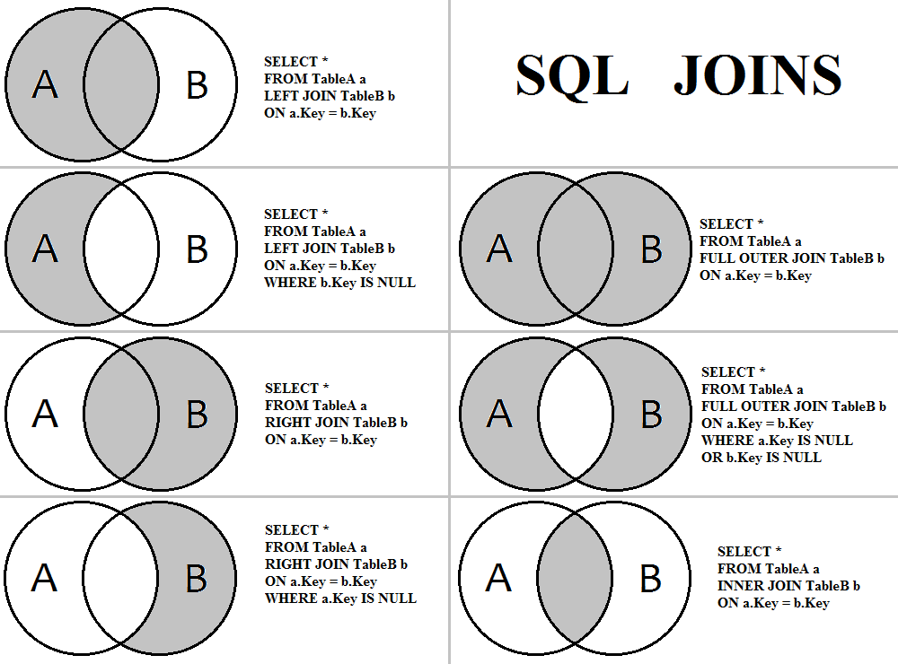

In the class, we have learned simple join. Sometimes, for some of the rows you are joining, you may not be able to find a matching records in another table. In that case, you still want to keep the records from one table after JOIN. In this lab-problem set, we will learn how to do that. 

The following figure shows different types of joins, and how to run the query for each type.



## Curtailed FacebookDB

```{r, eval = F}
library(DBI)
# create database: this will create a file in our hard drive
db <- dbConnect(RSQLite::SQLite(), "~/Data/my472/facebook-db-mini.sqlite")
# reading the first file
congress <- read.csv("~/Data/my472/congress-facebook-2017.csv",
	stringsAsFactors=F)

set.seed(20181128)
# sample 100 rows randomly
congress <- congress[sample(nrow(congress), 100), ]
# adding first table: user-level data
dbWriteTable(db, "congress", congress)
# testing that it works with a simple query
dbListFields(db, "congress")
dbGetQuery(db, 'SELECT * FROM congress LIMIT 5')
```


```{r, eval = F}

fls <- list.files("~/Data/my472/posts", full.names=TRUE)
set.seed(20181128)

for (f in fls){
  
  message(f)
  # read file into memory
  fb <- read.csv(f, stringsAsFactors=F)
  # sample 5 percent of rows randomly
  fb <- fb[sample(nrow(fb), size = nrow(fb)/20), ]
  
  # adding to table in SQL database
  dbWriteTable(db, "posts", fb, append=TRUE)
  
}
# testing that it works
dbListFields(db, "posts")
dbGetQuery(db, 'SELECT * FROM posts LIMIT 5')
# what if we make a mistake and want to remove the table?
# dbRemoveTable(db, "posts")
# and we close the connection for now
dbDisconnect(db)

```

## Questions

```{r}
library(DBI)
library(tidyverse)
db <- dbConnect(RSQLite::SQLite(), "~/Data/my472/facebook-db-mini.sqlite")
```

1. How many rows in each table
```{r}
dbGetQuery(db, 
"SELECT COUNT(*) FROM posts")

dbGetQuery(db, 
"SELECT COUNT(*) FROM congress")
```

2. How many rows by joining posts with congress?

```{r}

```

3. How many rows by left-joining posts with congress?

```{r}

```


4. What happens if you try right join?
```{r}

```

5. Try left outer join with `IS NULL` condition
```{r}

```


```{R}
dbDisconnect(db)
```

## Subquery


In SQL, you can run a nested query where you use a result from the first query as a condition for the second query. Where we find a top 3 most frequent posters in the congress, and then get all messages from them. 

```{r}
#connect to the full db
```

1. What are the screen names of the top 3 posters?

```{r}

```

2. (Without subquery) how to get the posts from these congress members?

```{r}

```

3. Now, instead of hardcoding the screen_names in the conditional statement, use the query results in #1 as the subquery. 


```{r}

```
