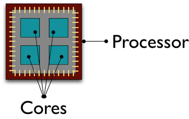

```{r}
library(tidyverse)
```

Some computations become too large or take too much time. Parallel computing can help if your program is too slow, too big, or contains too many computations. You can speed things up by using more cores on your computer. You can split a large problem into multiple smaller ones, where each can be solved by a single core in a cluster. Same with too many computations — each can be run by a separate core to speed things up.

In this course we did not look into code efficiency and that's where one should start with optimizing performance of their programs. However, there are limits: some computations take just too long even if written well.

Following the previous week, parallel computing in combination with cloud are an extremely powerful combination. We will run our computations on a personal computer because the free tier on AWS (or any other cloud computing service) contains only one core, but imagine running your scripts on AWS x1 that has 128 CPUs. Extreme computational power is becoming much more accessible than before (although still expensive). Nevertheless, with your skills now, you are able to scale any analysis or computational tool to access this power and push the boundaries of what you can do.

## Hardware
Modern computers often have several processors with several cores. That's where all computations take place. For example, a personal computer can have one processor with 4 cores (quad-core), allowing 4 computations to be executed at the same time.



You can check how many cores your computer has by running the following command from the `parallel` package:

```{r}
# install.packages("parallel")
library(parallel)
detectCores()
```

## How to parallelize?
For a task to be parallelalizable (possible to be parallelized), we need to be able to give each computer/processor/core something to do. Regular R code is not distributed across many cores by default and not all computations can be parallelized.

Large computations (e.g. estimating a model that uses iterative optimization, where result of the previous iteration is used in the subsequent calculation) or data pipelines are very hard to parallelize due to dependency of subsequent steps. Moreover, not all processes are worth parallelizing: the overhead of distributing the work across clusters and then combining the results of individual calculations can sometimes take longer!

Independent computations are great for parallelization: for example resampling techniques (such as bootstrap) or simulation models (power analysis, agent-based models). Many machine learning packages have already built-in options for parallel computation, which can speed up computation several-fold.

## Bootstrap example
Bootstrapping is a statistical technique that uses random sampling with replacement to  estimate properties of an estimator (e.g. variance, point estimates). It is often used as an alternative for statistical inference based on the assumption of a parametric model, when the model assumption is in doubt. See [ISL Chapter 5.2](http://faculty.marshall.usc.edu/gareth-james/ISL/ISLR%20Seventh%20Printing.pdf).

We will use the `iris` dataset (part of RStudio) (see `?iris`) to first resample and then calculate a simple regression model. Let us write everything in a single function, so that we can call it later.

```{r}

run_boot <- function(trial){
  # resample 100 observations from iris with replacement
  df <- sample_n(iris[, -5], size = 100, replace = TRUE)
  
  # estimate a linear regression to predict flower sepal length
  mod <- lm(Sepal.Length ~ . , data = df)
  
  # extract coefficients
  coefs <- coefficients(mod)
  
  return(coefs)
}

# check if runs
run_boot()

```

### Serial execution
Sensible bootstraps usually start at 5000 trials: the same operation is repeated over and over and the results are stored. We can do this in a `for()` loop or using `lapply()`. We will time how long will this take by using `system.time()` function. 

```{r}
trials <- seq(1, 5000)

time_lapply <- system.time({
  results <- lapply(trials, run_boot)
})

time_lapply

# # If you want to see the results, you can run this to get them to df
# results_df <- do.call(rbind.data.frame, results)
# # Rename
# names(results_df) <- names(results[[1]])
# # Plot parameter distribution
# hist(results_df$Sepal.Width)
```

### Parallel execution
Now, let us try parallelizing the process across (almost) all our cores!

```{r}

numCores <- detectCores() - 1       # to avoid crashing I use - 1

time_mclapply <- system.time({
  results <- mclapply(trials, run_boot,
                      mc.cores = numCores)
})

time_mclapply

```

That is quite a substantial time reduction on this task. For me, it ran approximately 3.5-times faster than with serial execution.

## Expected speedup?
Reductions in time are, however, not always so easy to understand. For some problems, there might be "perfect scaling" — adding another processor will decrease the computational time by the same amount as before. For other problems, the efficiency of adding another processor might decrease (there is overhead that reduces efficiency). This is beyond this course, but check out [Amdahl's Law](https://en.wikipedia.org/wiki/Amdahl%27s_law) to learn more

We can go crazy and plot performance on this problem by iteratively adding more cores and running the computation again:

```{r}

numCoresSeq <- seq(1, detectCores(), 1)
time_results <- data.frame()
trials <- seq(1, 5000)

for(numCores in numCoresSeq){
  # run the same operation by using different number of cores
  time_mclapply <- system.time({
    results <- mclapply(trials, run_boot,
                        mc.cores = numCores)
  })
  
  # store results of this specific run
  run_res <- c(numCores, 
               time_mclapply[3])
  
  # append to results df
  time_results <- rbind(time_results, run_res)
}

names(time_results) <- c("cores", "time")

time_results %>%
  ggplot(aes(x = cores, y = time)) + geom_point() + geom_line()

```

This works really well, because each process is independent from other processes and we have a large number of (simple) computations that we need to take. The batch is sufficiently large to justify the overhead for parallelization.

### When is it not useful to parallelize?
Let us try another simple example, where it might not be useful to parallelize.

```{r}
# A very simple function
run_sqrt <- function(trial){
  random_ints <- sample.int(100, 3, replace = TRUE)
  sqroot <- sqrt(random_ints)
  return(sqroot)
}

# Same setup as last time
numCoresSeq <- seq(1, detectCores(), 1)
time_results <- data.frame()
trials <- seq(1, 100)

for(numCores in numCoresSeq){
  # NOTE: we plugged in run_sqrt here
  time_mclapply <- system.time({
    results <- mclapply(trials, run_sqrt,
                        mc.cores = numCores)
  })
  
  # store results of this specific run
  run_res <- c(numCores, 
               time_mclapply[3])
  
  # append to results df
  time_results <- rbind(time_results, run_res)
}

names(time_results) <- c("cores", "time")

time_results %>%
  ggplot(aes(x = cores, y = time)) + geom_point() + geom_line()

```

We get a completely opposite result! Parallelizing an extremely simple operation is more timely than runnning it on a single core with default settings. Each added core means more work to figure out what work to give it and to distribute the work.

### More advanced
Load balancing is one of the common problems for parallel computing. Imagine you have 2 cores and 4 tasks in increasing complexity. First two (less complex) computations get assigned to the first core, while last two (more complex) get assigned to the second core. The first core finishes much sooner than the second and then stays idle - bad load balance.

By default, tasks are distributed ahead in order to minimize overhead. If you know in advance that different run-times might be a problem, you can switch to dynamic scheduling. This is supported by `mclapply()`.

```{r}
# Static scheduling - before the computation is run
system.time({
  results <- mclapply(trials, run_sqrt,
                      mc.cores = numCores)
})

# Dynamic scheduling - while the computation is running
system.time({
  results <- mclapply(trials, run_sqrt,
                      mc.cores = numCores,
                      mc.preschedule = FALSE)   # <--
})
```

In this case it severely prolongs computational time - more overhead. That's why it is important to know when to choose static vs. dynamic scheduling.

Another problem you can run into is memory. Although computation gets distributed across different cores (locally or on the cloud), you need to be cautious about not hitting memory limits. Functions we wrote above do not store much data. However, if you were to save every bootstrapped dataframe that we generated, we would run out of memory rather quickly. Computational power and memory are two separate concepts! Be efficient with what you need to store and what you can dipose of during computation:

- do not store duplicates of generated datasets
- keep only results/estimated coefficients/model summaries, not whole objects
- you can use `rm()` on objects you are not going to use anymore
- check object size with `object.size()`
- use functions as much as you can (variables are deleted automatically when function finishes executing)

Other packages that you might want to try are `foreach` and `doParallel`. They use syntax that is close to `for()` loops, therefore might be easier to understand to some. Let us try them with a simple script that takes `sqrt()`. Again, the expectation is that the parallel version here will take longer because of the overhead.

```{r}

suppressWarnings(library(foreach))
suppressWarnings(library(doParallel))

registerDoParallel(numCores)

# Serial execution
system.time({
  foreach (i = 1:3, .combine=rbind) %do% {   # %do% = serial
    sqrt(i)
  }
})

# Parallel execution
system.time({
  foreach (i = 1:3, .combine=rbind) %dopar% {   # %dopar% = parallel
    sqrt(i)
  }
})

stopImplicitCluster()

```


# References:

  - https://ljdursi.github.io/beyond-single-core-R/
  - https://blog.dominodatalab.com/multicore-data-science-r-python/
  - CRAN documentation for `doParallel` and `parallel`